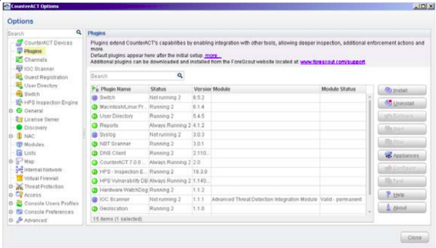
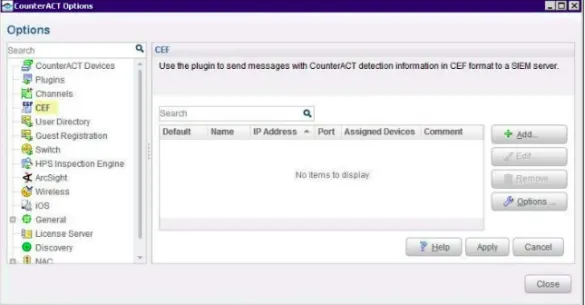
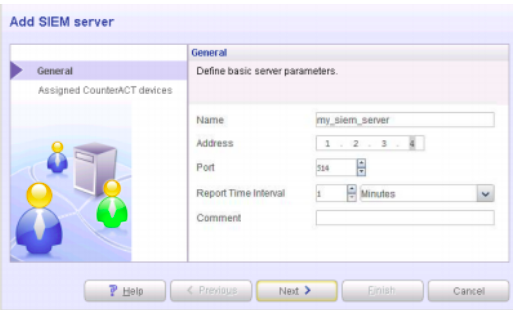
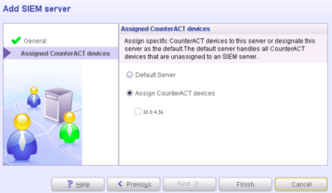
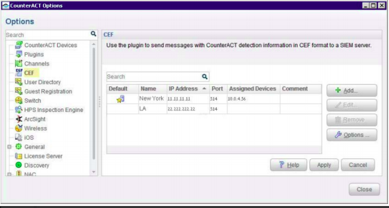

CounterACT is capable of notifying DNIF Adapters of endpoints that pass or fail CounterACT Compliance policies. For example, such policies detect hosts running out-of-date anti-virus signature files; hosts using unauthorized Peer to Peer applications, or hosts with missing vulnerability patches.

###### **Install Plugin**

This section describes how to install the plugin.

- Acquire a copy of the plugin in either one of the following ways:
    - If you are installing a Beta release of this plugin, acquire the plugin .fpi file from your ForeScout representative or contact [beta@forescout.com](mailto:)
    
    - OR navigate to the Customer Support, Base Plugins page and download the plugin .fpi file.

- Save the file to the machine where the CounterACT Console is installed.

- Log into the **CounterACT Console** and select **Options** from the Tools menu.

- Select **Plugins**. The Plugins pane opens.  
      
    
      
    

- Select **Install**. The **Open dialog** box opens.

- Browse to and select the saved plugin **.fpi** file.

- Select **Install**.

- An installation or upgrade information dialog box and a license agreement dialog box will open. Accept the license agreement to proceed with the installation.

- Once the installation is complete, select **Close**. The plugin is listed in the Plugins pane.

###### **Configuring the ForeScout CounterACT Plug-in**

To configure the plugin:

- Select **Configure**. The CEF configuration pane opens  
      
    
      
    

- To add a SIEM server, select **Add**. The **Add SIEM server** wizard is displayed.  
      
    
      
    

In the **General** pane, enter basic server parameters.

- In the **Server Address** field, enter the IP address of DNIF.

- From the Port list, select **514**.

- Click **Next**.

- From the Assigned CounterACT devices pane, choose one of the following options:  
      
    
      
    

- **Default Server:** Select this option to make all devices on this ForeScout CounterACT, forward events to DNIF.

- **Assign CounterACT devices:** Select this option to assign which individual devices that are running on ForeScout CounterACT forward events to DNIF. The Assign CounterACT devices option is only available if you have one or more ForeScout CounterACT servers.

- Click **Finish**. The server configuration appears in the CEF pane.  
      
    
      
    

- Use **Add/Edit/Remove** to manage the CEF configurations.

For more information, refer [CounterACT™ CEF Plugin](https://docs.forescout.com/download/resource/bundle/cef-2-6-x-h/raw/resource/enus/cef-2-6-x-h.pdf?token=TWQ3b3NBQXZSYWtTSXY0RFRZOCtUQ0xhSytNcTBBTlJ2cGpDZFZHV0RRVUxDcTlCMHAyNkdtSGlMZWE3MnFuMDlURzhMQ1lLdHdJZjBHMzNaVGpFaTAwbUhpYzZMdmxjN0trakhZbHZoYlZBUkVWdW0zZHdHc05Ia1FxV3Fqb2x5dVdyYmJ2WGlTUSs0a1h3clhRb2FYaDJsK3ZMREIrdXdUd1Q0RlVzOElmOEVza2Q=)
