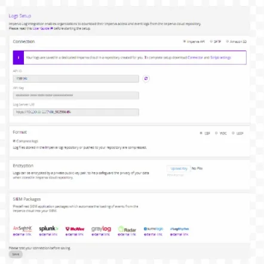
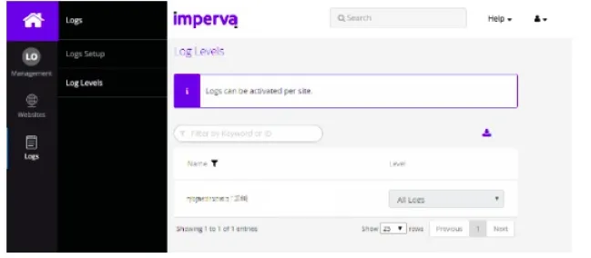

  
To configure log integration:

- Log into your [my.imperva.com](https://authentication-management.service.imperva.com/login) account and navigate to the Logs Setup page:
    - **New UI**: On the top menu bar, click **Account > Account Management**. On the sidebar, click **SIEM Logs Setup > Logs Setup**.
    
    - **Classic UI**: On the sidebar, click **Logs > Log Setup**.  
          
        
          
          
        

- Select a connection mode.

- Select the format for the log files: CEF (default).

- Click Save to save all changes.

- On the sidebar, click Log Levels. The following window is displayed  
      
    
      
    

Select a log level for each site to enable logging, or leave disabled.

[Official Documentation](https://docs.imperva.com/bundle/cloud-application-security/page/settings/log-integration.htm)

