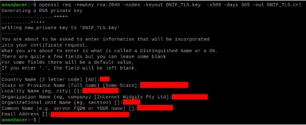
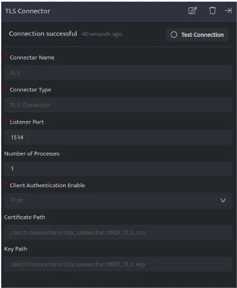

Palo Alto Networks provides a wide suite of enterprise-level next-generation firewalls, with a diverse range of security features for the network.

1. [Configure Syslog](#configure-syslog)

3. [Configuring Syslog Format for Palo Alto Networks Devices](#configure_syslog_palo)

5. [Configure TLS](#configure-TLS)

7. [Validate Logs](#validatelogs)

To send log events from Palo Alto to DNIF HYPERCLOUD, complete the following steps:

- [Configure a Syslog server profile](#configure-syslog)

- [Configure syslog forwarding for Traffic, Threat, and WildFire Submission logs](#Configure-syslog-forwarding-for-Traffic-Threat)

- [Configure syslog forwarding for System, Config, HIP Match, and Correlation logs](#HIPmatchandcorrelationlogs)

- [(Optional) Configure the header format of syslog messages](#Configureheaderformat)

- [Create a certificate to secure syslog communication over TLSv1.2](#Certificatetosecuresyslog)

- [Commit your changes and review the logs on the syslog server](#commitchangesandreviewlogs)

- [(Optional) Configure the firewall to terminate the connection to the syslog server upon FQDN refresh](#Configurefirewalltoterminate)

**Step I: Configure a Syslog server profile.**

- Select Device Server Profiles Syslog..

- Click Add and enter a Name for the profile.

- If the firewall has more than one virtual system (vsys), select the Location (vsys or  
    Shared ) where this profile is available.

- For each syslog server, click Add and enter the information that the firewall requires to connect to it:
    - Name—Unique name for the server profile.
    
    - Syslog Server—IP address or fully qualified domain name (FQDN) of the syslog server.

If you configure an FQDN and use UDP  transport, if the firewall cannot resolve the FQDN, the firewall uses the existing IP address resolution for the FQDN as the Syslog Server address. 

- Transport—Select TCP,UDP, or SSL (TLS) as the protocol for communicating with the syslog server. For SL , the firewall supports only TLSv1.2.

- Port —The port number on which to send syslog messages (default is UDP on port 514); you must use the same port number on the firewall and the syslog server.

- Format—Select the syslog message format to use: BSD  (the default) or IETF. Traditionally, BSD format is over UDP and IETF  format is over TCP or SSL/TLS.

- Facility—Select a syslog standard value (default is LOG\_USER) to calculate the priority (PRI) field in your syslog server implementation. Select the value that maps to how you use the PRI field to manage your syslog messages.

- (Optional) To customize the format of the syslog messages that the firewall sends, select the Custom Log Format  tab. For details on how to create custom formats for the various log types, refer to the [Common Event Format Configuration Guide](https://docs.paloaltonetworks.com/resources/cef).

- Click OK to save the server profile.

**Step II - Configure syslog forwarding for Traffic, Threat, and WildFire Submission logs.  
**

- Configure the firewall to forward logs. For more information, see Step [Create a Log Forwarding profile.](https://docs.paloaltonetworks.com/content/techdocs/en_US/pan-os/10-1/pan-os-admin/monitoring/configure-log-forwarding.html#id1443a62b-8a0b-41db-a08d-5df934bf0ffc_idd40c0d1a-7191-4616-9573-f02a99352eae)

- Select Objects Log Forwarding, click Add, and enter a Name to identify the profile.

- For each log type and each severity level or WildFire verdict, select the Syslog server profile and click OK.

- Assign the log forwarding profile to a security policy to trigger log generation and forwarding. For more information, See Step [Assign the Log Forwarding profile to policy rules and network zones.](https://docs.paloaltonetworks.com/content/techdocs/en_US/pan-os/10-1/pan-os-admin/monitoring/configure-log-forwarding.html#id1443a62b-8a0b-41db-a08d-5df934bf0ffc_id6c337a4d-8869-498e-9d4f-630d2739b151)

- Select Policies Security and select a policy rule.

- Select the Actions tab and select the Log Forwarding profile you created.

- For Traffic logs, select one or both of the Log at Session Start and Log At Session End  
    check boxes, and click OK

- For detailed information about configuring a log forwarding profile and assigning the profile to a policy rule, see [Configure Log Forwarding](https://docs.paloaltonetworks.com/content/techdocs/en_US/pan-os/10-1/pan-os-admin/monitoring/configure-log-forwarding.html#id1443a62b-8a0b-41db-a08d-5df934bf0ffc)

**Step  III - Configure syslog forwarding for System, Config, HIP Match, and Correlation logs.**

- Select Device > Log Settings

- For System and Correlation logs, click each Severity level, select the  
    Syslog server profile, and click OK

- For Config, HIP Match, and Correlation logs, edit the section, select the  
    Syslog server profile, and click OK

**Step IV - (Optional) Configure the header format of syslog messages.**

The log data includes the unique identifier of the firewall that generated the log. Choosing the header format provides more flexibility in filtering and reporting on the log data for some Security Information and Event Management (SIEM) servers.

This is a global setting and applies to all Syslog server profiles configured on the firewall.

- Select Device Setup Management and edit the Logging and Reporting Settings.

- Select the Log Export and Reporting tab and select the Syslog HOSTNAME Format:
    - FQDN (default)—Concatenates the hostname and domain name defined on the sending firewall.
    
    - hostname—Uses the hostname defined on the sending firewall.
    
    - ipv4-address—Uses the IPv4 address of the firewall interface used to send logs. By default, this is the MGT interface.
    
    - ipv6-address—Uses the IPv6 address of the firewall interface used to send logs. By default, this is the MGT interface.
    
    - none-Leaves the hostname field unconfigured on the firewall. There is no identifier for the firewall that sent the logs.

- Click OK to save your changes.

**Step V - Create a certificate to secure syslog communication over TLSv1.2.**

Required only if the syslog server uses client authentication. The syslog server uses the certificate to verify that the firewall is authorized to communicate with the syslog server.

Ensure the following conditions are met:

-  The private key must be available on the sending firewall; the keys can't reside on a Hardware Security Module (HSM).

- The subject and the issuer for the certificate must not be identical.

- The syslog server and the sending firewall must have certificates that the same trusted certificate authority (CA) signed. Alternatively, you can generate a self-signed certificate on the firewall, export the certificate from the firewall, and import it in to the syslog server.

- The connection to a Syslog server over TLS is validated using the Online Certificate Status Protocol (OCSP) or using Certificate Revocation Lists (CRL) so long as each certificate in the trust chain specifies one or both of these extensions. However, you cannot bypass OCSP or CRL failures so you must ensure that the certificate chain is valid and that you can verify each certificate using OCSP or CRL.

- Select Device > Certificate Management > Certificates > Device Certificates  
    and click Generate.

- Enter a Name for the certificate.

- In the Common Name field, enter the IP address of the firewall sending logs to the syslog server.

- In Signed by, select the trusted CA or the self-signed CA that the syslog server and the sending firewall both trust. The certificate can't be a Certificate Authority nor an External Authority (certificate signing request \[CSR\]).

- Click Generate. The firewall generates the certificate and key pair.

- Click the certificate Name to edit it, select the Certificate for Secure Syslog check box, and click OK

**Step VI - Commit your changes and review the logs on the syslog server**

- Click Commit

- To review the logs, refer to the documentation of your syslog management software. You can also review the [Syslog Field Descriptions](https://docs.paloaltonetworks.com/content/techdocs/en_US/pan-os/10-1/pan-os-admin/monitoring/use-syslog-for-monitoring/syslog-field-descriptions.html#ida7775ba5-a408-4239-bbba-6132050948bd).

**Step VII - (Optional) Configure the firewall to terminate the connection to the syslog server upon FQDN refresh.**

When you configure a syslog server profile using a FQDN, the firewall maintains its connection to the syslog server by default in the event of an FQDN name change.

For example, you have replaced an existing syslog server with a new syslog server that uses a different FQDN name. If you want the firewall to connect to the new syslog server using a new FQDN name, you can configure the firewall to automatically terminate its connection to the old syslog server and establish a connection to the new syslog server using the new FQDN name.

- [Log in to the firewall CLI](https://docs.paloaltonetworks.com/pan-os/10-1/pan-os-cli-quick-start/get-started-with-the-cli/access-the-cli.html).

- Configure the firewall to terminate the connection to the syslog server upon FQDN refresh

**Configuring Syslog Format for Palo Alto Networks Devices**

**Objective:** Modify Syslog format on Palo Alto Networks devices to ensure log format compatibility.

**Please Note:** Palo Alto can send only one format to all Syslog devices. By modifying the Syslog format, any other device that requires Syslog must support that same format.

**Procedure:**

- **Log in to Palo Alto Networks:**
    - Access the Palo Alto Networks device interface using authorized credentials.

- **Navigate to Server Profiles > Syslog:**
    - On the Device tab, locate and click on "Server Profiles."
    
    - From the dropdown menu, select "Syslog."

- **Add Syslog Destination:**
    - Click on the "Add" button to create a new Syslog destination.
    
    - In the Syslog Server Profile dialog box:
        - Click "Add" to specify a new destination.
        
        - Enter the details:
            - Name: Specify a name for the Syslog server (e.g., DNIF).
            
            - Server IP Address: Enter the IP address of DC PICO (DNIF).
            
            - Port: 514 (UDP)
            
            - Facility: Define the facility for the Syslog server.

- ****Configure LEEF Events:**** 
    
    **Please note:** Due to formatting issues, copy the text into a text editor, remove any carriage return or line feed characters, and then paste it into the appropriate field.
    
    - Switch to the "Custom Log Format" tab in the Syslog Server Profile dialog.
    
      
    
    - Under "Config Log Format":  
        
        ```
        LEEF:2.0|Palo Alto Networks|PAN-OS Syslog Integration|$sender_sw_version|$result|x7C|TimeReceived=$receive_time|DeviceSN=$serial|cat=$type|devTime=$cef-formatted-receive_time|src=$host|VirtualSystem=$vsys|msg=$cmd|usrName=$admin|client=$client|Result=$result|ConfigurationPath=$path|sequence=$seqno|ActionFlags=$actionflags|BeforeChangeDetail=$before-change-detail|AfterChangeDetail=$after-change-detail|DeviceGroupHierarchyL1=$dg_hier_level_1|DeviceGroupHierarchyL2=$dg_hier_level_2|DeviceGroupHierarchyL3=$dg_hier_level_3|DeviceGroupHierarchyL4=$dg_hier_level_4|vSrcName=$vsys_name|DeviceName=$device_name
        ```
        
      
    - Under "System Log Format":  
        
        ```
        LEEF:2.0|Palo Alto Networks|PAN-OS Syslog Integration|$sender_sw_version|$eventid|x7C|TimeReceived=$receive_time|DeviceSN=$serial|cat=$type|Subtype=$subtype|devTime=$cef-formatted-receive_time|VirtualSystem=$vsys|Filename=$object|Module=$module|sev=$number-of-severity|Severity=$severity|msg=$opaque|sequence=$seqno|ActionFlags=$actionflags|DeviceGroupHierarchyL1=$dg_hier_level_1|DeviceGroupHierarchyL2=$dg_hier_level_2|DeviceGroupHierarchyL3=$dg_hier_level_3|DeviceGroupHierarchyL4=$dg_hier_level_4|vSrcName=$vsys_name|DeviceName=$device_name
        ```
        
      
    - Under "Threat Log Format":  
        
        ```
        LEEF:2.0|Palo Alto Networks|PAN-OS Syslog Integration|$sender_sw_version|$threatid|x7C|ProfileToken=$actionflags|TimeReceived=$receive_time|DeviceSN=$serial|cat=$type|SubType=$subtype|ConfigVersion=$sender_sw_version|src=$src|dst=$dst|Rule=$rule|usrName=$srcuser|Application=$app|VirtualLocation=$vsys|FromZone=$from|ToZone=$to|InboundInterface=$inbound_if|OutboundInterface=$outbound_if|LogSetting=$logset|SessionID=$sessionid|RepeatCount=$repeatcnt|srcPort=$sport|dstPort=$dport|srcPostNATPort=$natsport|dstPostNATPort=$natdport|proto=$proto|Action=$action|FileName=$misc|VendorSeverity=$severity|DirectionOfAttack=$direction|SequenceNo=$seqno|SourceLocation=$srcloc|DestinationLocation=$dstloc|PacketID=$pcap_id|FileHash=$filedigest|ApplianceOrCloud=$cloud|URLCounter=$url_idx|FileType=$filetype|SenderEmail=$sender|EmailSubject=$subject|RecipientEmail=$recipient|ReportID=$reportid|DGHierarchyLevel1=$dg_hier_level_1|DGHierarchyLevel2=$dg_hier_level_2|DGHierarchyLevel3=$dg_hier_level_3|DGHierarchyLevel4=$dg_hier_level_4|VirtualSystemName=$vsys_name|DeviceName=$device_name|SourceUUID=$src_uuid|DestinationUUID=$dst_uuid|IMSI=$imsi|IMEI=$imei|ParentSessionID=$parent_session_id|ParentStarttime=$parent_start_time|Tunnel=$tunnel|ThreatCategory=$thr_category|ContentVersion=$contentver|SigFlags=$sig_flags|RuleUUID=$rule_uuid|
        ```
        
          
        
        ```
        HTTP2Connection=$http2_connection|DynamicUserGroupName=$dynusergroup_name|X-Forwarded-ForIP=$xff_ip|SourceDeviceCategory=$src_category|SourceDeviceProfile=$src_profile|SourceDeviceModel=$src_model|SourceDeviceMac=$src_mac|DestinationDeviceCategory=$dst_category|DestinationDeviceProfile=$dst_profile|DestinationDeviceHost=$dst_host|DestinationDeviceMac=$dst_mac|SourceEDL=$src_edl|DestinationEDL=$dst_edl|HostID=$hostid|EndpointSerialNumber=$serialnumber|DomainEDL=$domain_edl|SourceDynamicAddressGroup=$src_dag|DestinationDynamicAddressGroup=$dst_dag|PartialHash=$partial_hash|TimeGeneratedHighResolution=$high_res_timestamp|NSSAINetworkSliceType=$nssai_sst|devTimeFormat=$cef-formatted-time_generated
        ```
        
      
    - Under "Traffic Log Format":  
        
        ```
        LEEF:2.0|Palo Alto Networks|PAN-OS Syslog Integration|$sender_sw_version|$action|x7C|ProfileToken=$actionflags|TimeReceived=$receive_time|DeviceSN=$serial|cat=$type|SubType=$subtype|devTime=$cef-formatted-receive_time|src=$src|dst=$dst|Rule=$rule|usrName=$srcuser|Application=$app|FromZone=$from|ToZone=$to|LogSetting=$logset|SessionID=$sessionid|srcPort=$sport|dstPort=$dport|proto=$proto|Bytes=$bytes|srcBytes=$bytes_sent|dstBytes=$bytes_received|totalPackets=$packets|SessionStartTime=$start|SessionDuration=$elapsed|URLCategory=$category|SequenceNo=$seqno|SourceLocation=$srcloc|DestinationLocation=$dstloc|srcPackets=$pkts_sent|dstPackets=$pkts_received|SessionEndReason=$session_end_reason|VirtualSystemName=$vsys_name|DeviceName=$device_name|ActionSource=$action_source|SourceUUID=$src_uuid|DestinationUUID=$dst_uuid
        ```
        
      
    - For versions other than PAN-OS 3.0 - 6.1:  
          
        - Click "HIP Match" and paste  
            
            ```
            LEEF:2.0|Palo Alto Networks|PAN-OS Syslog Integration|$sender_sw_version|$matchname|x7C|ProfileToken=$actionflags|TimeReceived=$receive_time|DeviceSN=$serial|cat=$type|SubType=$subtype|ConfigVersion=$sender_sw_version|devTime=$cef-formatted-receive_time|usrName=$srcuser|VirtualLocation=$vsys|identHostName=$machinename|EndpointOSType=$os|iOSsrc=$src|CountOfRepeats=$repeatcnt|SequenceNo=$seqno|DGHierarchyLevel1=$dg_hier_level_1|DGHierarchyLevel2=$dg_hier_level_2|DGHierarchyLevel3=$dg_hier_level_3|DGHierarchyLevel4=$dg_hier_level_4|VirtualSystemName=$vsys_name|DeviceName=$device_name|VirtualSystemID=$vsys_id|SourceIPv6=$srcipv6|HostID=$hostid|EndpointSerialNumber=$serialnumber|SourceDeviceCategory=$reclassified|SourceDeviceModel=$matchtype|SourceDeviceMac=$mac|TimestampDeviceIdentification=$time_generated|TimeGeneratedHighResolution=$high_res_timestamp|devTimeFormat=$cef-formatted-time_generated
            ```
            
      
    - Under "URL FILTERING":  
        
        ```
        LEEF:2.0|Palo Alto Networks|PAN-OS Syslog Integration|$sender_sw_version|$threatid|x7C|ProfileToken=$actionflags|TimeReceived=$receive_time|DeviceSN=$serial|cat=$type|SubType=$subtype|devTime=$cef-formatted-receive_time|src=$src|dst=$dst|Rule=$rule|usrName=$srcuser|Application=$app|FromZone=$from|ToZone=$to|LogSetting=$logset|SessionID=$sessionid|srcPort=$sport|dstPort=$dport|proto=$proto|Action=$action|URL=$file_url|VendorSeverity=$severity|DirectionOfAttack=$direction|SequenceNo=$seqno|SourceLocation=$srcloc|DestinationLocation=$dstloc|ContentType=$contenttype|PacketID=$pcap_id|URLCounter=$url_idx|UserAgent=$user_agent|Referer=$referer|VirtualSystemName=$vsys_name|DeviceName=$device_name|SourceUUID=$src_uuid|DestinationUUID=$dst_uuid|HTTPMethod=$http_method|IMSI=$imsi|IMEI=$imei|ContentVersion=$contentver|SigFlags=$sig_flags|HTTPHeaders=$http_headers|URLCategoryList=$url_category_list|RuleUUID=$rule_uuid|HTTP2Connection=$http2_connection|DynamicUserGroupName=$dynusergroup_name|X-Forwarded-ForIP=$xff_ip|SourceDeviceCategory=$src_category|SourceDeviceProfile=$src_profile|SourceDeviceModel=$src_model|SourceDeviceVendor=$src_vendor|SourceDeviceOSFamily=$src_osfamily|SourceDeviceOSVersion=$src_osversion|SourceDeviceHost=$src_host|SourceDeviceMac=$src_mac|DestinationDeviceCategory=$dst_category|DestinationDeviceProfile=$dst_profile|DestinationDeviceModel=$dst_model|DestinationDeviceVendor=$dst_vendor|DestinationDeviceOSFamily=$dst_osfamily|DestinationDeviceOSVersion=$dst_osversion|DestinationDeviceHost=$dst_host|DestinationDeviceMac=$dst_mac|ContainerID=$container_id|ContainerNameSpace=$pod_namespace|ContainerName=$pod_name|SourceEDL=$src_edl|DestinationEDL=$dst_edl|HostID=$hostid|EndpointSerialNumber=$serialnumber|SourceDynamicAddressGroup=$src_dag|DestinationDynamicAddressGroup=$dst_dag|TimeGeneratedHighResolution=$high_res_timestamp|NSSAINetworkSliceType=$nssai_sst|devTimeFormat=$cef-formatted-time_generated
        ```
        
      
    - Under "Wildfire":  
        
        ```
        LEEF:2.0|Palo Alto Networks|PAN-OS Syslog Integration|$sender_sw_version|$threatid|x7C|ProfileToken=$actionflags|TimeReceived=$receive_time|DeviceSN=$serial|cat=$type|SubType=$subtype|ConfigVersion=$sender_sw_version|devTime=$cef-formatted-receive_time|src=$src|dst=$dst|srcPostNAT=$natsrc|dstPostNAT=$natdst|Rule=$rule|usrName=$srcuser|DestinationUser=$dstuser|Application=$app|VirtualLocation=$vsys|FromZone=$from|ToZone=$to|InboundInterface=$inbound_if|OutboundInterface=$outbound_if|LogSetting=$logset|SessionID=$sessionid|RepeatCount=$repeatcnt|srcPort=$spor|dstPort=$dport|srcPostNATPort=$natsport|dstPostNATPort=$natdport|proto=$proto|Action=$action|FileName=$misc|VendorSeverity=$severity|DirectionOfAttack=$direction|SequenceNo=$seqno|SourceLocation=$srcloc|DestinationLocation=$dstloc|PacketID=$pcap_id|FileHash=$filedigest|ApplianceOrCloud=$cloud
        ```
        
      
    - Under "Authentication":  
        
        ```
        LEEF:2.0|Palo Alto Networks|PAN-OS Syslog Integration|$sender_sw_version|$event|x7C|ProfileToken=$actionflags|TimeReceived=$receive_time|DeviceSN=$serial|cat=$type|SubType=$subtype|ConfigVersion=$sender_sw_version|devTime=$cef-formatted-receive_time|VirtualLocation=$vsys|src=$ip|User=$normalize_user|usrName=$user|Object=$object|object2AuthenticationPolicy=$authpolicy|CountOfRepeats=$repeatcnt|MFAAuthenticationID=-$authid|MFAVendor=$vendor|LogSetting=$logset|AuthServerProfile=$serverprofile|AuthenticationDescription=$desc|ClientType=$clienttype|AuthFactorNo=$factorno|SequenceNo=$seqno|DGHierarchyLevel1=$dg_hier_level_1|DGHierarchyLevel2=$dg_hier_level_2|DGHierarchyLevel3=$dg_hier_level_3|DGHierarchyLevel4=$dg_hier_level_4|VirtualSystemName=$vsys_name|DeviceName=$device_name|VirtualSystemID=$vsys_id|AuthenticationProtocol=$authproto|RuleMatchedUUID=$rule_uuid|TimeGeneratedHighResolution=$high_res_timestamp|SourceDeviceCategory=$src_category|SourceDeviceProfile=$src_profile|SourceDeviceModel=$src_model|SourceDeviceVendor=$src_vendor|SourceDeviceOSFamily=$src_osfamily|SourceDeviceOSVersion=$src_osversion|SourceDeviceHost=$src_host|SourceDeviceMac=s$src_mac|AuthCacheServiceRegion=$region|UserAgentString=$user_agent|SessionID=$sessionid|devTimeFormat=$cef-formatted-time_generated
        ```
        
      
    - Under "User-ID":  
        
        ```
        LEEF:2.0|Palo Alto Networks|PAN-OS Syslog Integration|$sender_sw_version|$subtype|x7C|ProfileToken=$actionflags|TimeReceived=$receive_time|DeviceSN=$serial|cat=$type|ConfigVersion=$sender_sw_version|devTime=$cef-formatted-receive_time|VirtualLocation=$vsys|src=$ip|usrName=$user|MappingDataSourceName=$datasourcename|EventIdName=$eventid|CountofRepeats=$repeatcnt|MappingTimeout=$timeout|srcPort=$beginport|dstPort=$endport|MappingDataSource=$datasource|MappingDataSourceType=$datasourcetype|SequenceNo=$seqno|DGHierarchyLevel1=$dg_hier_level_1|DGHierarchyLevel2=$dg_hier_level_2|DGHierarchyLevel3=$dg_hier_level_3|DGHierarchyLevel4=$dg_hier_level_4|VirtualSystemName=$vsys_name|DeviceName=$device_name|VirtualSystemID=$vsys_id|MFAFactorType=$factortype|AuthCompletionTime=$factorcompletiontime|AuthFactorNo=$factorno|UGFlags=$ugflags|UserIdentifiedBySource=$userbysource|Tag=$tag_name|TimeGeneratedHighResolution=$high_res_timestamp|devTimeFormat=$cef-formatted-time_generated
        ```
        
      
    - Under "Tunnel Inspection":  
        
        ```
        LEEF:2.0|Palo Alto Networks|PAN-OS Syslog Integration|$sender_sw_version|$action|x7C|ProfileToken=$actionflags|TimeReceived=$receive_time|DeviceSN=$serial|cat=$type|SubType=$subtype|ConfigVersion=$sender_sw_version|devTime=$cef-formatted-receive_time|src=$src|dst=$dst|srcPostNAT=$natsrc|dstPostNAT=$natdst|Rule=$rule|usrName=$srcuser|DestinationUser=$dstuse|Application=$app|VirtualLocation=$vsys|FromZone=$from|ToZone=$to|InboundInterface=$inbound_if|OutboundInterface=$outbound_if|LogSetting=$logset|SessionID=$sessionid|RepeatCount=$repeatcnt|srcPort=$sport|dstPort=$dport|srcPostNATPort=$natsport|dstPostNATPort=$natdport|proto=$proto|SequenceNo=$seqno|SourceLocation=$srcloc|DestinationLocation=$dstloc|DGHierarchyLevel1=$dg_hier_level_1|DGHierarchyLevel2=$dg_hier_level_2|DGHierarchyLevel3=$dg_hier_level_3|DGHierarchyLevel4=$dg_hier_level_4|VirtualSystemName=$vsys_name|DeviceName=$device_name|ParentSessionID=$parent_session_id|ParentStarttime=$parent_start_time|Tunnel=$tunnel|Bytes=$bytes|srcBytes=$bytes_sent|dstBytes=$bytes_received|totalPackets=$packets|srcPackets=$pkts_sent|dstPackets=$pkts_received|TunnelSessionsCreated=$sessions_created|TunnelSessionsClosed=$sessions_closed|SessionEndReason=$session_end_reason|ActionSource=$action_source|startTime=$start|SessionDuration=$elapsed|RuleUUID=$rule_uuid|DynamicUserGroupName=$dynusergroup_name|ContainerID=$container_id|ContainerNameSpace=$pod_namespace|ContainerName=$pod_name|SourceEDL=$src_edl|DestinationEDL=$dst_edl|SourceDynamicAddressGroup=$src_dag|DestinationDynamicAddressGroup=dst_dag|TimeGeneratedHighResolution=$high_res_timestamp|NSSAINetworkSliceDifferentiator=$nssai_sd|NSSAINetworkSliceType=$nssai_sst|ProtocolDataUnitsessionID=$pdu_session_id|devTimeFormat=$cef-formatted-time_generated
        ```
        
      
    - Under "GlobalProtect":  
        
        ```
        LEEF:2.0|Palo Alto Networks|PAN-OS Syslog Integration|$sender_sw_version|$result|x7C|TimeReceived=$receive_time|DeviceSN=$serial|cat=$type|devTime=$cef-formatted-receive_time|src=$host|VirtualSystem=$vsys|msg=$cmd|usrName=$admin|client=$client|Result=$result|ConfigurationPath=$path|sequence=$seqno|ActionFlags=$actionflags|BeforeChangeDetail=$before-change-detail|AfterChangeDetail=$after-change-detail|DeviceGroupHierarchyL1=$dg_hier_level_1|DeviceGroupHierarchyL2=$dg_hier_level_2|DeviceGroupHierarchyL3=$dg_hier_level_3|DeviceGroupHierarchyL4=$dg_hier_level_4|vSrcName=$vsys_name|DeviceName=$device_name
        ```
        
      
    - Under "Decryption":  
        
        ```
        LEEF:2.0|Palo Alto Networks|PAN-OS Syslog Integration|$sender_sw_version|$eventid|x7C|TimeReceived=$receive_time|DeviceSN=$serial|cat=$type|Subtype=$subtype|devTime=$cef-formatted-receive_time|VirtualSystem=$vsys|Filename=$object|Module=$module|sev=$number-of-severity|Severity=$severity|msg=$opaque|sequence=$seqno|ActionFlags=$actionflags|DeviceGroupHierarchyL1=$dg_hier_level_1|DeviceGroupHierarchyL2=$dg_hier_level_2|DeviceGroupHierarchyL3=$dg_hier_level_3|DeviceGroupHierarchyL4=$dg_hier_level_4|vSrcName=$vsys_name|DeviceName=$device_name
        ```
        
      
    - Under "File Data":
        
        ```
        LEEF:2.0|Palo Alto Networks|PAN-OS Syslog Integration|$sender_sw_version|$threatid|x7C|ProfileToken=$actionflags|TimeReceived=$receive_time|DeviceSN=$serial|cat=$type|SubType=$subtype|ConfigVersion=$sender_sw_version|src=$src|dst=$dst|Rule=$rule|usrName=$srcuser|Application=$app|VirtualLocation=$vsys|FromZone=$from|ToZone=$to|InboundInterface=$inbound_if|OutboundInterface=$outbound_if|LogSetting=$logset|SessionID=$sessionid|RepeatCount=$repeatcnt|srcPort=$sport|dstPort=$dport|srcPostNATPort=$natsport|dstPostNATPort=$natdport|proto=$proto|Action=$action|FileName=$misc|VendorSeverity=$severity|DirectionOfAttack=$direction|SequenceNo=$seqno|SourceLocation=$srcloc|DestinationLocation=$dstloc|PacketID=$pcap_id|FileHash=$filedigest|ApplianceOrCloud=$cloud|URLCounter=$url_idx|FileType=$filetype|SenderEmail=$sender|EmailSubject=$subject|RecipientEmail=$recipient|ReportID=$reportid|DGHierarchyLevel1=$dg_hier_level_1|DGHierarchyLevel2=$dg_hier_level_2|DGHierarchyLevel3=$dg_hier_level_3|DGHierarchyLevel4=$dg_hier_level_4|VirtualSystemName=$vsys_name|DeviceName=$device_name|SourceUUID=$src_uuid|DestinationUUID=$dst_uuid|IMSI=$imsi|IMEI=$imei|ParentSessionID=$parent_session_id|ParentStarttime=$parent_start_time|Tunnel=$tunnel|ThreatCategory=$thr_category|ContentVersion=$contentver|SigFlags=$sig_flags|RuleUUID=$rule_uuid|
        ```
        
    
      
    

1. **Specify Severity of Events:**
    - Click on "Log Settings" to define the severity of events in Syslog messages.
    
    - For each severity level:
        - Click on the severity name and select the Syslog destination (DNIF) from the Syslog menu.
    
    - Click "OK" to confirm.

3. **Commit Changes:**
    - Click on "Commit" to save and apply the configured Syslog settings.

###### **TLS Connector**

TLS Connector can receive logs from various devices and log sources via TCP connection with SSL on any custom port

**Pre-requisites**

- Certificate and key files OR default certificate and key

**Certificate and Key Generation**

The certificate and key are generated in pairs by the following command using openssl:

openssl req -newkey rsa:2048 -nodes -keyout DNIF\_TLS.key -x509 -days 365 -out DNIF\_TLS.crt

This certificate with -days parameter as 365 is valid for 365 days from date of generation.

The command on execution prompts for organisational information:



  
These are self signed certificate-key pair which are stored at the location "/dnif/connectors/tls\_connector/".

**Ship certificates from other location**

If there is a requirement of individual cert-key pair for every TLS Connector process or if you have your own cert-key pair (say org-x.crt and org-x.key ), then:

1. The files need to be moved to Host at the location  
    "/DNIF/AD/connectors/tls\_connector/org-x.crt" and "/DNIF/AD/connectors/tls\_connector/org-x.key"

3. As the mount point of Host "/DNIF/AD/" is "/dnif/" inside the container, therefore the configuration of TLS Connector should have :

- Certificate Path as "/dnif/connectors/tls\_connector/org-x.crt"

- Key Path as "/dnif/connectors/tls\_connector/org-x.key"

###### **Configuration**

TLS Connector operates in two modes. The following settings need to be applied while spawning the TLS connector:



**Mode 1: Client Authentication Enable set to True**

Configuring the TLS connector in this mode requires the client to authenticate the server(TLS Listener) using the Certificate (.crt) file to start communication.

**Configuration details:**

|   **Configuration**   |   **Description**   |   **Value**   |
| --- | --- | --- |
|   Connector Name   |   Name assigned to connector shall be visible on console in Connector's list. The name should therefore be unique to easier identification.   |   TLS   |
|   Connector Type   |   This is populated by default based on the connector that is added via the '+' icon when adding a connector. It must be a valid connector type.   |   TLS Connector   |
|   Listener Port   |   The port on which the TLS Listener shall listen for incoming data. The log sending on the client side should be configured to send data to this port. Multiple TLS Connectors can be spawned on different ports.   |   1514   |
|   Number of Processes   |   The number of processes spawned for the connector.   |   1   |
|   Client Authentication Enable   |   This must be set to True to operate TLS Connector to work in this mode. The client (TLS sender) should connect using the certificate(.crt) file to communicate with the server.(Default Value is True)   |   True   |
|   Certificate Path   |   The path to the certificate(.crt) file is to be entered here. DNIF TLS Connector is shipped with a default crt file [ DNIF\_TLS.crt ].   |   The default path to this file is /dnif/connectors/tls\_connector/DNIF\_TLS.crt   |
|   Key Path   |   The path to the key(.key) file is to be entered here. DNIF TLS Connector is shipped with a default key file [ DNIF\_TLS.key ].   |   The default path to this file is /dnif/connectors/tls\_connector/DNIF\_TLS.key   |

**Mode 2: Client Authentication Enable set to False**

Configuring TLS connector in this mode can allow the client to communicate with server(TLS Listener) without using the Certificate (.crt) file.

**Configuration details:**

|   **Configuration**   |   **Description**   |   **Value**   |
| --- | --- | --- |
|   Connector Name   |   Name assigned to connector shall be visible on console in Connector's list. The name should therefore be unique to easier identification.   |   TLS   |
|   Connector Type   |   This is populated by default based on the connector that is added via the '+' icon when adding a connector. It must be a valid connector type.   |   TLS Connector   |
|   Listener Port   |   The port on which the TLS Listener shall listen for incoming data. The log sending on the client side should be configured to send data to this port. Multiple TLS Connectors can be spawned on different ports.   |   1514   |
|   Number of Processes   |   The number of processes spawned for the connector.   |   1   |
|   Client Authentication Enable   |   This must be set to False to operate TLS Connector to work in this mode. The client (TLS sender) does not require the certificate(.crt) file to communicate with the server.   |   False   |
|   Certificate Path   |   The path to the certificate(.crt) file is to be entered here. DNIF TLS Connector is shipped with a default crt file [ DNIF\_TLS.crt ].   |   The default path to this file is /dnif/connectors/tls\_connector/DNIF\_TLS.crt   |
|   Key Path   |   The path to the key(.key) file is to be entered here. DNIF TLS Connector is shipped with a default key file [ DNIF\_TLS.key ].   |   The default path to this file is /dnif/connectors/tls\_connector/DNIF\_TLS.key   |

- Click **Save** after entering all the required details and click **Test Connection**, to test the configuration.

- A **Connection successful** message will be displayed on screen along with the time stamp.

- If the connection is not successful an error message will be displayed. Refer [Troubleshooting Connector Validations](https://dnif.it/kb/troubleshooting-and-debugging/troubleshooting-connector-validations/) for more details on the error message.

Once the connector is configured, validate if the connector is listed under [Collection Status](https://dnif.it/kb/operations/collection-status/) screen with status as **Active**. This signifies the connector is configured successfully and data is ready to ingest.

###### **Validate Logs**

From the [collection status](https://dnif.it/kb/operations/collection-status/) page, check the stream in which the logs of the particular device are allocated.

Now go to the [search block](https://dnif.it/kb/hunting-with-workbooks/getting-started-hunting-with-workbooks/create-a-search-block-2/) and check the log details for the specific stream in this case Firewall.

```
<_fetch * from event where $Duration=5m AND $DevSrcIP='Palo-Alto_IP' limit 100>
```
