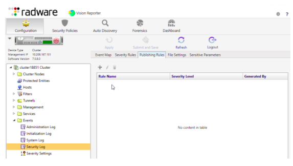
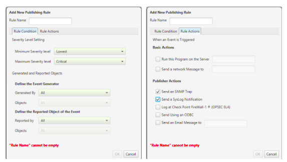

###### **Configuration to publish events**

- The Publisher daemon must first be enabled In order to publish events.
- Next, you need to configure a Publishing Rule for the relevant Log Type.
- Escalation and the Security log rules will be configured under the Security Policies View in AppWall, while the other types are configured under the Configuration View.
- In the following image, you can view where to add new publishing rules for the securityevents:  
    
    
    
- On clicking the add button, the next dialog box to configure your new rule will be dispalyed.
- You can define the following while configuring a Publishing rule.
    - A range of Severity levels
    - Types of events to be published to which remote recipient
- In the following image you can view how you configure a security Publishing rule.
    
    
    

[Official Documentation](https://support.radware.com/ci/okcsFattach/get/15873_3)

