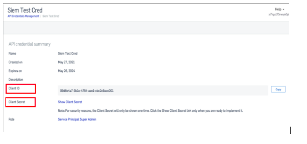

###### **Configuration for log forwarding**

Sophos Central has secured APIs available for customers. These allow the retrieval of event and alert data from Sophos Central, for use in other systems.

Sending alert and event data to DNIF

- Click the Clone or download to download the zip file containing all components of the [Sophos Central Integration script](https://github.com/sophos/Sophos-Central-SIEM-Integration).
    - You should run the script from a machine running Python 3+.

- You will require API Credentials to access event/alert data via the API. In Sophos Central Admin, go to **Global Settings > API Credentials Management**.

- To create a new token, click **Add Credential** from the top-right corner of the screen.

- Select a Credential name and select the appropriate role and add a description if you want and click **Add**. The API credential Summary for this credential is displayed.

- Click **Show Client Secret** to display Client Secret.  
      
      
      
    

- Open config.ini in a text editor. (skip the 'token_info' section)
    - Copy Client ID and Client Secret from the API Credentials Management page in Sophos Central to client_id and client_secret fields
    
    - Update the auth_url and api_host sections to be:
        - auth_url = [https://id.sophos.com/api/v2/oauth2/token](https://id.sophos.com/api/v2/oauth2/token)
        
        - api_host = api.central.sophos.com

- curl -H "Authorization: Bearer " -H "X-Partner-ID: " [https://api.central.sophos.com/partner/v1/tenants](https://api.central.sophos.com/partner/v1/tenants)

- curl -H "Authorization: Bearer " -H "X-Organization-ID: " [https://api.central.sophos.com/organization/v1/tenants](https://api.central.sophos.com/organization/v1/tenants)  
    * You can obtain jwt from sophos id api and partner-id/organization-id from whoami api. You can visit [https://developer.sophos.com/getting-started](https://developer.sophos.com/getting-started) for more details about these apis.
    - Optional: By default, the script will output JSON data to a results.txt file in a subdirectory called logs. The log format should be JSON only.

- Run the python siem.py script and review the results.txt output file.

[Official Documentation](https://support.sophos.com/support/s/article/KB-000036372?language=en_US)

