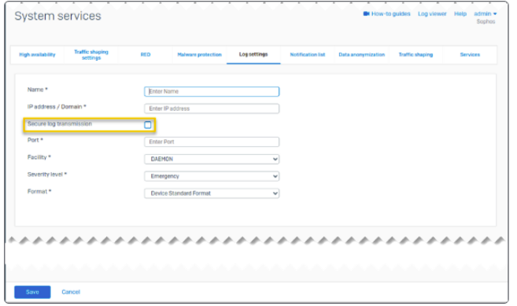

###### **Configuring the Syslog Server**

This article provides information on how to set up the Sophos XG Firewall to send logs to DNIF.

Log into your Sophos XG Firewall and follow these steps

- Go to **System services > Log settings** and click **Add**.
- Enter a name.
- Specify the settings.

| **Option** | **Description** |
| --- | --- |
| **IP address/domain** | IP address or domain name of the syslog server. Logs are sent to this server. |
| **Secure log transmission** | Encrypts logs sent to the syslog server using TLS. |
| **Port** | Port number for communication with the syslog server. |
| **Facility** | Informs the syslog server of the log message's source. The facility indicates the log source, for example, an operating system, process, or application. You can configure the facility to distinguish log messages from different devices. The **LOCAL0-LOCAL7** option refers to log level information. |
| **Severity level** | Minimum severity level of messages reported. Sophos Firewall logs all messages with a severity level equal to or greater than the level you select. For example, select **Error** to log all messages tagged as error and all messages tagged as critical, alert, and emergency. Select **Debug** to include all messages. Alert means that action must be taken immediately. This has a higher severity level than Critical. |
| **Format** | **Log format**: Choose the following option:  - **Device Standard Format**: Logs generated from Sophos Firewall modules aren't in standard syslog format, so the number of data fields in the logs for each module differs. You can use this option when you send logs to any third-party syslog server.   |

Configure Sophos with the following details:

Secure log transmission can only be set to on or off.

- Click Save

Go to Log settings and select the logs you want to send to syslog server.
