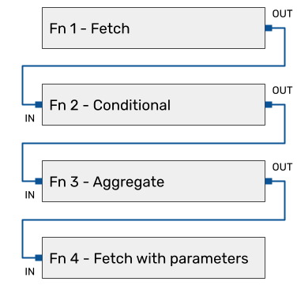

  
**DNIF Query Language is a powerful analytic markup that goes from looking for specifics to talking to destinations over a webhook. It is simple and modular and has an engaging vocabulary.**

Data that has volume (ever increasing data), velocity (more data every minute) and variety (unstructured data or data with varying structures). As DNIF receives data every second from multiple devices and in various formats, it transforms, enriches and stores this information in its stores.

A SIEM needs a strong interaction backplane that can be used to query, process, investigate and respond to threats. DNIF Query Language (DQL) was created to span across functions and interaction points for the user.

DQL has been refined over the years to bring in more capability and to keep all operations of the SIEM under a single contiguous process. DNIF uses DQL to -

- Search and process data using workbooks

- Power up widgets in a dashboard

- Create a customized report

- Raise a signal (alert) and track

- Hunt for threats without structure

DQL Queries can be manually executed using workbooks or they can also be scheduled to be run in periodic intervals or trigger when there is a match using streaming.

## **Build with the pipeline**

DNIF implements a data pipeline just like the one you would experience in Jupyter Notebooks. In order to understand a pipeline imagine multiple code blocks or functions and the fact that data will need to sequentially pass from one code block to the other.

  
The diagram talks about four functions that is connected in pipeline where the outcome of the first function is passed on as an input to the second function block. The second function block is able to use the input and perform more computations on it before it sends the output to the third function block.
