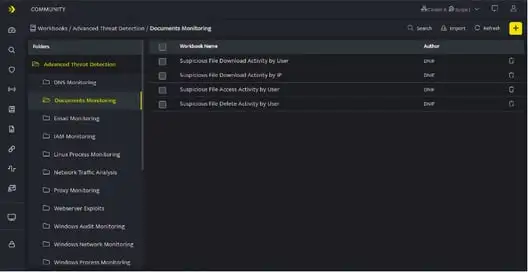
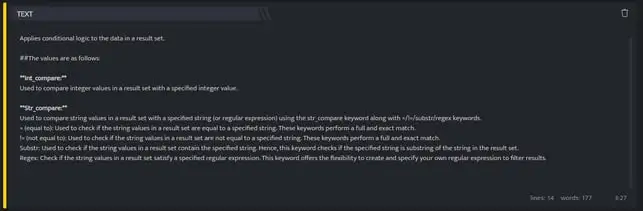
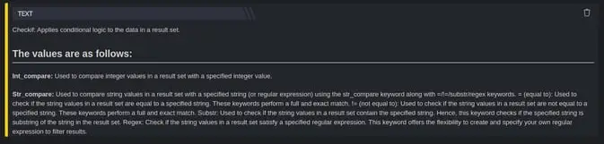

  
Text Block explains the use, description of the particular workbook, you can include details such as what can be achieved from this workbook, why it should be used and also include the various dependencies, steps to achieve the target result. You can also write a very descriptive use case specific to this workbook. Text blocks can be used as the reference document for a particular workbook. The text block editor is a markdown editor that would help you to apply styles and formats to the added text.

## **How to add a Text Block?**

- Hover on the **Workbooks** icon on the left navigation bar, it will display the folder wise view of existing workbooks in the tenant (previously known as cluster).

- Click the **plus** icon on the Workbook page and select **Text Block** from the list. The following screen is displayed:

- Enter the required information in the Markdown Editor

- Click anywhere outside the **Text Block**, to preview the Text Block as displayed below.

For more details on Workbooks refer [Create a Workbook](https://dnif-documentation.github.io/DNIF/docs/hyperscale/Hunting-with-Workbooks/Getting-Started/how-to-create-a-workbook-2).
