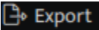
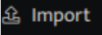
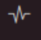

- Hover on the **Workbooks** icon on the left navigation bar, it will display the folder-wise view of existing workbooks in the tenant (previously known as cluster).  
    
The following fields appear in the workbook list:

| Field | Description |
| --- | --- |
| Workbook Name | Displays the name of the workbook. |
| Stream | Displays the stream(s) associated with the workbook.The green indicator  shows that there is data in the stream(s)   The red indicator  shows that there is no data in the stream(s) |
| Signal(30d) | Displays the total number of signals raised in the last 30 days |
| Last Signal | Displays the time when the last signal was raised |
| Tags | Displays the labels assigned to the workbook  |
| Stage | Displays the current environment of the workbook (test, beta, dev, prod) |
| Version | Displays the  current version number of the workbook |
| Updated | Displays when the workbook was modified |
|  | Used to search for an existing workbook |
|   | Used to filter existing workbooks based on the following:   Detection Tactic   Detection Technique   Detection Severity   Detection Score   Enabled   Schedule   Source Stream   Tags   Stage |
|  | Used to refresh and display the updated workbook list |
|   | Used to export an existing workbook in the following format.    PDF   XLSX   CSV   ZIP   Select Fields  |
|   | Used to import workbook |
|   | Used to create a new workbook |
|   | Indicated the workbook is streamed |
|   | Click this to delete the specific workbook |
|   | Indicates that the workbook is scheduled |
