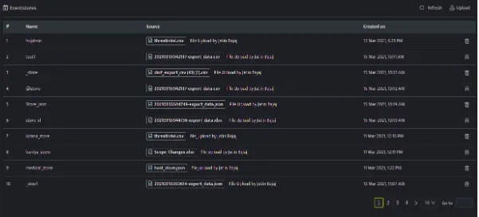
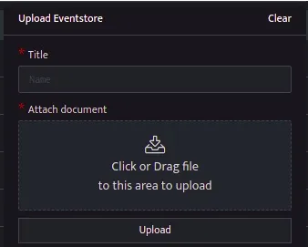

An event store is simply a data store for all the events where you can rapidly analyze the data. Custom Event Stores can be uploaded in csv, json, xls, xslx formats. You can store your database details and query from there for later usage. You can identify or investigate events or observations that raise a suspicion and can also automate these queries to run at an interval or on demand as per requirement.

###### **How to upload custom event stores?**

- Hover on the Administration icon on the left navigation panel and select Configure Event Stores, the following page will be displayed.

- Click upload on the extreme right of the above page, the following screen will be displayed.

| **Field** | **Description** |
| --- | --- |
| Title | Enter a title name for the event store that you are about to create. |
| Attach document | You can drag and drop a file or click to browse and upload a file.The supported file formats are csv, json, xls, xslx format. |
| Upload | Click this to finish the upload process. |

- Click refresh and the event store that you created will be listed.
