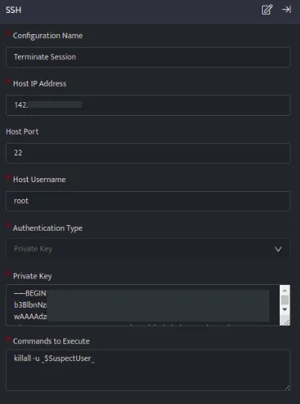
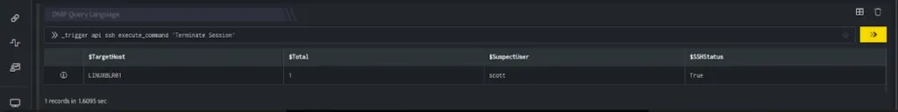
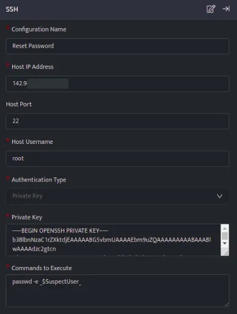
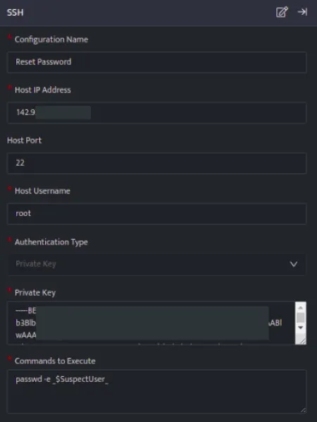
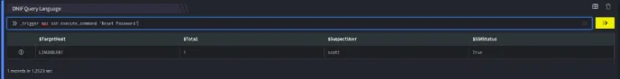
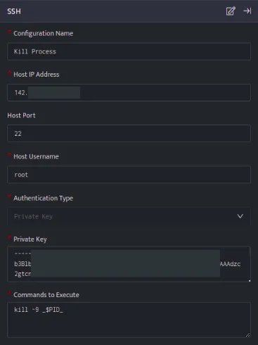
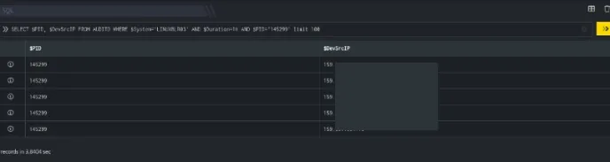
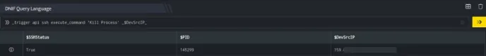

This article lists few examples, these examples will help you to quickly get started with the configuration process by demonstrating practical use cases.

- [Terminate active sessions](#Terminate-active-sessions)

- [Reset Password](#Reset-Password)

- [Kill a suspicious process](#Kill-a-suspicious-process)

###### **Terminate active sessions**

The below configuration allows you to connect to host and run any commands:



- In the above configuration, the **killall -u** command, will terminate all the active sessions for the specified user.

- Once SSH integration is configured, run a search.  
    


- In the above figure, a workbook named **Response for Compromised Account** is executed that displays a suspected User on execution of the workbook.  
    



```
_trigger api ssh execute_command 'Terminate Session'
```

- Using _trigger query, an api call is made to the ssh integration (Terminate Session) configuration, which will terminate the active sessions for the suspected user.

###### **Reset Password**

The below configuration allows you to connect to host and run any commands:



- In the above configuration, the **passwd -e &lt;Username&gt;** command, will reset the password of the specified user.

- Once SSH integration is configured, run a search.  
      
      
    

- In the above figure, a workbook named **Response for Compromised Account** is executed that displays a suspected User on execution of the workbook.  
      
      
    

```
_trigger api ssh execute_command 'Reset Password'
```

- Using _trigger query, an api call is made to the ssh integration (Reset Password) configuration, which will reset the password for the suspected user

###### **Kill a suspicious process**

The below configuration allows user to connect to host and run a command:



- In the above configuration, the **kill -9 &lt;Process ID&gt;** command, will will kill the specified Process ID.

- Once SSH integration is configured, run a search.  
      
      
    

- In the above figure, a search query is executed that displays all the suspicious Process ID's against the respective $DevSrcIP.  
      
      
    

```
_trigger api ssh execute_command 'Kill Process' _$DevSrcIP_
```

- Using _trigger query, an api call is made to the ssh integration (Kill Process) configuration, which will terminate the processes running on the host $DevSrcIP.
