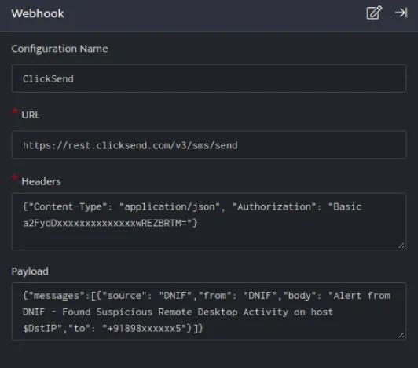
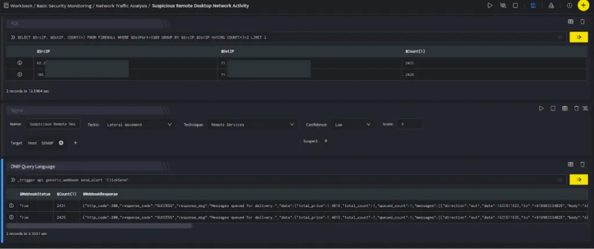

ClickSend is a multi channel business communications platform that offers SMS, MMS, Voice, Fax, Email, Post Letter and Postcard. This integration helps to send automated messages from apps when something happens.

###### **Configuration**

- In the **[Configuration](https://dnif.it/kb/uncategorized/configuring-automation/) Box**, enter the **Configuration Name** to uniquely identify this configuration.

- Identify the content of [headers and payload](https://developers.clicksend.com/docs/rest/v3/?shell#ClickSend-v3-API-SMS) that you need to provide in the Configuration Box.  
    

Below is an example on how you can leverage this plugin to send alerts to your mobile using ClickSend.

**Payload**

```
{   "messages":[      {         "source": "DNIF",         "from": "DNIF",         "body": "Alert from DNIF - Found Suspicious Remote Desktop Activity on host $DstIP",         "to": "+91898xxxxxx5"      }   ]}
```

Below is the template to add more than one mobile number:

**Payload**

```
{   "messages":[      {         "source": "DNIF",         "from": "DNIF",         "body": "Alert from DNIF - Found Suspicious Remote Desktop Activity on host $DstIP",         "to": "+91898xxxxxx5"      },	  {         "source": "DNIF",         "from": "DNIF",         "body": "Alert from DNIF - Found Suspicious Remote Desktop Activity on host $DstIP",         "to": "+91898xxxxxx6"      },	  {         "source": "DNIF",         "from": "DNIF",         "body": "Alert from DNIF - Found Suspicious Remote Desktop Activity on host $DstIP",         "to": "+91898xxxxxx7"      },	  {         "source": "DNIF",         "from": "DNIF",         "body": "Alert from DNIF - Found Suspicious Remote Desktop Activity on host $DstIP",         "to": "+91898xxxxxx8"      }   ]}
```



ClickSend, delivers an SMS based on the text mentioned in the **Payload**.



In the above figure, a workbook named **Suspicious Remote Desktop Network Activity** is executed which contains the following blocks:

- **SQL Block:** Displays two suspicious Destination IPs on execution of the workbook

- **Signal Block:** This will raise a signal on detecting the suspicious IPs.

- **DQL Block with \_trigger query:** Using **Webhook integration for ClickSend**, an alert will be sent to the mobile with the message mentioned in payload as displayed below:  
      
    
