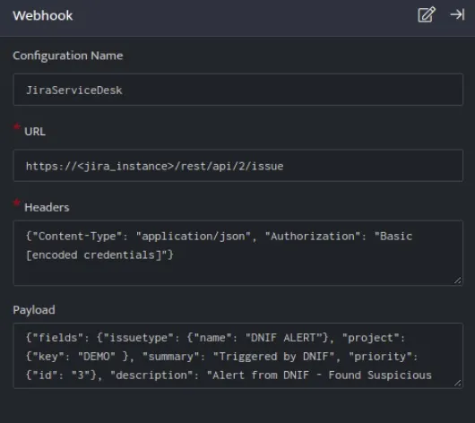
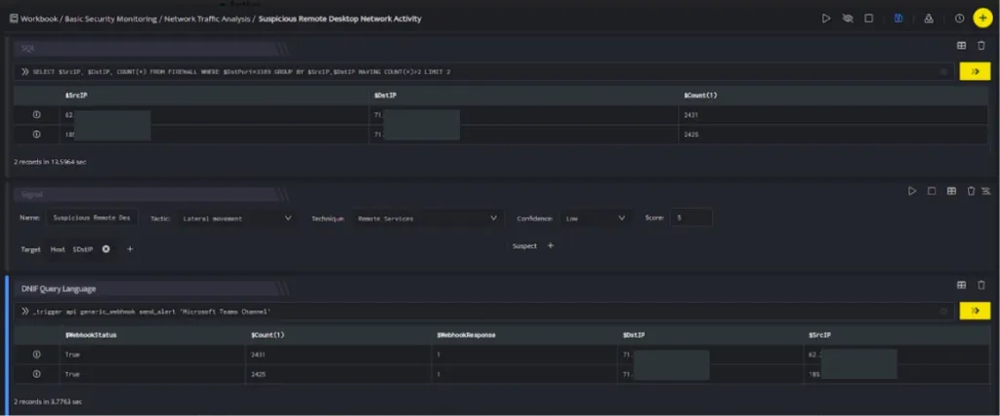

JiraServiceDesk integration helps you to create Jira issues in Jira Service Desk from alerts.

###### **Configuration**

- In the **[Configuration](https://dnif.it/kb/uncategorized/configuring-automation/) Box**, enter the **Configuration Name** to uniquely identify this configuration.

- Identify the content of [headers and payload](https://developer.atlassian.com/server/jira/platform/jira-rest-api-examples/) that you need to provide in the Configuration Box.  
    

Below is an example on how you can leverage this integration to create an issue on Jira Service Desk:

**Payload**

```
{    "fields": {        "issuetype": {            "name": "DNIF ALERT",            "project": {                "key": "DEMO"            },            "summary": "Triggered by DNIF",            "priority": {                "id": "3"            },            "description": "Alert from DNIF - Found Suspicious Remote Desktop Activity on host $DstIP"        }    }}
```



JiraServiceDesk, creates an issue on the Jira Service Desk based on the values given in the payload.



In the above figure, a workbook named **Suspicious Remote Desktop Network Activity** is executed which contains the following blocks:

- **SQL Block:** Displays two suspicious Destination IPs on execution of the workbook

- **Signal Block:** This will raise a signal on detecting the suspicious IPs.

- **DQL block with \_trigger query:** Using **Webhook integration for JiraServiceDesk**, an issue will be created on Jira Service Desk based on the values given in the payload.
