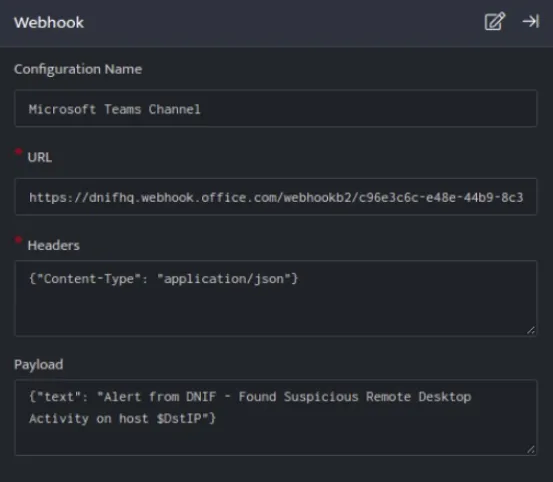
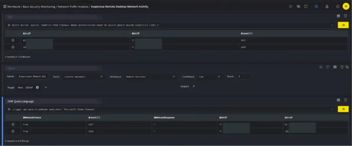
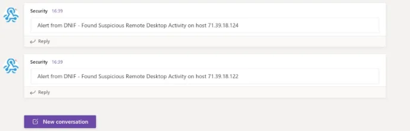

Microsoft Teams is a collaborative workspace within Microsoft 365/Office 365 that is used for workplace conversations.  

###### **Configuration**

- In the **[Configuration](https://dnif.it/kb/uncategorized/configuring-automation/) Box**, enter the **Configuration Name** to uniquely identify this configuration.

- [Create a webhook](https://learn.microsoft.com/en-us/microsoftteams/platform/webhooks-and-connectors/how-to/add-incoming-webhook?tabs=newteams%2Cdotnet) for a Microsoft Teams channel in your account.

- [Identify the content of headers and payload](https://docs.microsoft.com/en-us/microsoftteams/platform/webhooks-and-connectors/how-to/connectors-using) that you need to provide in the Configuration Box.

Below is an example on how you can leverage this integration to send alerts to your Microsoft Teams Channel.
**Payload**
```json
{
  "text":"Alert from DNIF - Found Suspicious Remote Desktop Activity on host $DstIP"
}
```

MS Team, delivers text mentioned in the **Payload** to your MS Teams channel.  

  
      
  
      
In the above figure, a workbook named **Suspicious Remote Desktop Network Activity** is executed which contains the following blocks:  
      
    
- **SQL Block:** Displays two suspicious Destination IPs on execution of the workbook
    
      
    
- **Signal Block:** This will raise a signal on detecting the suspicious IPs.
    
      
    
- **DQL block with \_trigger query:** Using **Webhook integration for Microsoft Teams Channel**, an alert will be raised to the teams channel with the message mentioned in payload as displayed below:
    
      

