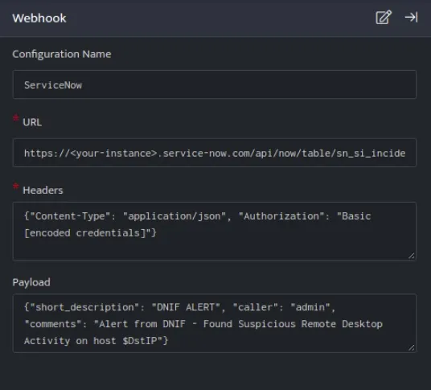
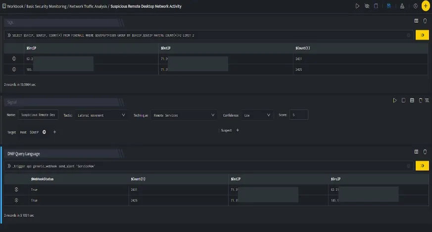

ServiceNow is a software as a service (SaaS) product for technical management support.

###### **Configuration**

- In the **Configuration Box**, enter the **Configuration Name** to uniquely identify this configuration.

- Identify the content of [headers and payload](https://docs.servicenow.com/bundle/quebec-application-development/page/integrate/inbound-rest/concept/c_TableAPI.html#c_TableAPI) that you need to provide in the Configuration Box.

Below is an example on how you can leverage this plugin to create an incident on Service Now:

**Payload**

```
{   "short_description":"DNIF ALERT",   "caller":"admin",   "comments":"Alert from DNIF - Found Suspicious Remote Desktop Activity on host $DstIP"}
```



ServiceNow API, creates an incident on the Service Now account based on the values given in the payload. This plugin is basically provisioned to replace the $SrcIP, $DstIP variables with the value received from the data stack received on running a Search block.



In the above figure, a workbook named **Suspicious Remote Desktop Network Activity** is executed which contains the following blocks:

- **SQL Block:** Displays two suspicious Destination IPs on execution of the workbook

- **Signal Block:** This will raise a signal on detecting the suspicious IPs.

- **DQL block with \_trigger query:** Using **Generic Webhook plugin for Service Now**, an incident is created on Service Now based on the values given in the payload.
