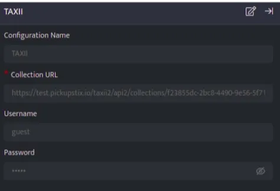
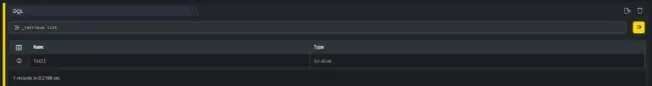
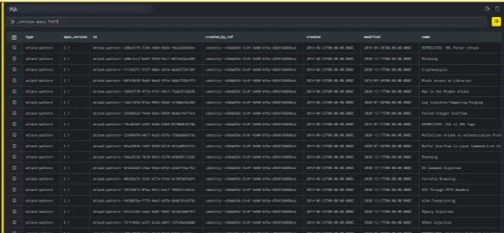

TAXII, short for Trusted Automated exchange of Intelligence Information, defines how cyber threat information can be shared via services and message exchanges.

It is designed specifically to support STIX information, which it does by defining an API that aligns with the common sharing model.

###### **Configuration**

- Follow the initial configuration steps in [How to Configure Soar Integrations?](https://dnif.it/kb/uncategorized/configuring-automation/)  
      
      
      
    

- Click the edit icon to add details

| **Field** | **Description** |
| --- | --- |
| Configuration Name | Enter the configuration name |
| Collection URL | Enter valid collection URL, which exists on TAXII server and user has read access to it. |
| Username | Enter Username of the TAXII server (if any) |
| Password | Enter Password of the TAXII server (if any) |

###### **Dataset integrated with TAXII**  

**Retrieve threat intel data**

TAXII integration will be configured in DNIF with unique configuration names, it can be configured multiple times. It stores data as a dataset in an eventstore. This is a scheduled eventstore and can be used to fetch threat intel data.

**Function\_name**

```
Import_any_intel
```

**Input**

```
_retrieve list
```

The above query retrieves a list of all the existing event stores. The output is as shown below:



**Output**

```
_retrieve query <config_name>
```

In the absence of config name, the eventstore will be named after the plugin name. Hence query accordingly.

```
_retrieve query <plugin_name>
```

In the pipelined query function, \_retrieve directive queries the eventstore to fetch threat intel data.

The output is as shown below:



**Output Structure**

Output structure will be in stix format
