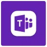

## **Overview**

DNIF is a strong automation platform that enhances security operations with security analytics and security automation. Multiple third-party endpoints can be integrated with existing applications, simplifying interoperability with a range of third-party applications. These integrations enable automated actions and workflows across antivirus tools, DLP, IAM tools, web proxy, SIEM, third-party intelligence, email security, operating systems, enterprise applications, and more to support out-of-the-box and custom use cases in your environment.

DNIF offers the following out-of-the-box automations:

| **Automations** | **Summary** |
| --- | --- |
|    | [Active Directory](/docs/hyperscale/Platform-Services/Supported-Automation/active-directory.md) Active directory integration is the process of incorporating directory services — a suite of tools for managing users, groups, and resources into a network of computers.  It works by storing all your user data in one place, essentially becoming a single switchboard for user data and access privileges. System administrators can use active directory to add or remove users, groups, and resources quickly and efficiently through one dashboard. |
|      | [AlienVault](/docs/hyperscale/Platform-Services/Supported-Automation/alienvault) AlienVault Open Threat Exchange (OTX) is the world's most authoritative open threat information sharing and analysis network. This integration allows anyone in the security community to actively discuss, research, validate, and share the latest threat data, trends, and techniques allowing users to both contribute and receive real-time information about malicious hosts. In addition, it offers you a chance to increase security visibility and control in your network. |
|    | [Domain Tools](/docs/hyperscale/Platform-Services/Supported-Automation/domain-tools.md)DomainTools integration helps security analysts turn threat data into threat intelligence. It takes indicators from your network, including domains and IP addresses, and connects them with nearly every active domain on the internet. These connections perform risk assessments, help profile attackers, guide online fraud investigations, and map cyber activity to the attacker's infrastructure. |
|    | [URLhaus](/docs/hyperscale/Platform-Services/Supported-Automation/urlhaus.md) URLhaus integration allows you to get information about malicious URLs and domains, and to download malware samples. This is a pre-configured integration in DNIF which can be used fetch threat intel data and also lookup for malicious URLs, Hosts and Files. |
|    | [Virustotal](/docs/hyperscale/Platform-Services/Supported-Automation/virustotal.md) The Virus Total integration enables you to request the analysis of suspicious IP addresses, hashes, and URL addresses to aid in your investigation to determine if they are malicious. It lets you upload and scan files, submit and scan URLs, access finished scan reports and make automatic comments on URLs and samples without the need of using the HTML website interface. |
|    | [Palo Alto](/docs/hyperscale/Platform-Services/Supported-Automation/palo-alto.md) Securing your enterprise starts with your firewall. This integration safeguards internet networks from known and unknown security threats with the Palo Alto security appliance. |
|    | [GreenSnow](/docs/hyperscale/Platform-Services/Supported-Automation/greensnow.md) GreenSnow is a team consisting of the best specialists in computer security, who harvest a large number of IPs from different computers located around the world. GreenSnow is comparable with SpamHaus.org for attacks of any kind except for spam. |
|    | [Fortigate](/docs/hyperscale/Platform-Services/Supported-Automation/fortigate-1.md) FortiGate is a core part of security fabric and validated security to protect the enterprise network from known and unknown attacks. This integration is used to manage firewall settings and groups. |
|    | [Slack](/docs/hyperscale/Platform-Services/Supported-Automation/slack-configuration.md) Slack is a new generation communication application. It unites your team and your apps for better information sharing and collaboration. |
 |    | [Microsoft Teams Channel](/docs/hyperscale/Platform-Services/Supported-Automation/microsoft-teams-channel.md) Microsoft Teams is a collaborative workspace within Microsoft 365/Office 365 that is used for workplace conversations. ||    | [ClickSend](/docs/hyperscale/Platform-Services/Supported-Automation/clicksend.md) ClickSend is a multi channel business communications platform that offers SMS, MMS, Voice, Fax, Email, Post Letter and Postcard. This integration helps to send automated messages from apps when something happens. |
|    | [PagerDuty](/docs/hyperscale/Platform-Services/Supported-Automation/pagerduty.md) PagerDuty webhook connections allow you to send alert results as a PagerDuty notification. You can learn more about [PagerDuty webhooks](/docs/hyperscale/Platform-Services/Supported-Automation/pagerduty.md). |
|    | [JiraServiceDesk](/docs/hyperscale/Platform-Services/Supported-Automation/jiraservicedesk.md)JiraServiceDesk integration helps you to create Jira issues in Jira Service Desk from alerts. |
|     |[ServiceNow](/docs/hyperscale/Platform-Services/Supported-Automation/servicenow.md) ServiceNow is a software as a service (SaaS) product for technical management support. |
|     | [New Relic](/docs/hyperscale/Platform-Services/Supported-Automation/new-relic.md) New Relic webhook connections allows you to send alert results to New Relic as a custom event. You can learn more about [New Relic](/docs/hyperscale/Platform-Services/Supported-Automation/new-relic.md). |
|     |[Opsgenie](/docs/hyperscale/Platform-Services/Supported-Automation/opsgenie.md) DNIF can send webhook alerts to Opsgenie that acts as a dispatcher and determines the right people to notify. |
|     | [TrendMicro](/docs/hyperscale/Platform-Services/Supported-Automation/trendmicro.md) Trend Micro is a cloud-client content security infrastructure that delivers global threat intelligence to protect from online threats, such as data stealing malware, phishing attacks, and other web, email, and mobile threats. It helps to deliver continuously updated protection to stop phishing, ransomware, Business Email Compromise (BEC) scams, spam and other advanced email threats before they reach your network. It provides advanced protection for Microsoft™ Exchange Server, Microsoft Office 365, Google™ Gmail, and other cloud or on-premises email solutions. |
|     |[Webhook](/docs/hyperscale/Platform-Services/Supported-Automation/webhook.md) Webhook provides you with a simple interface to integrate DNIF with various third party application's webhook/api. |
| SSH | [SSH](/docs/hyperscale/Platform-Services/Supported-Automation-SSH/ssh-configuration.md) SSH, or Secure Shell, integration is used to establish a secure connection to a remote host and execute commands. It allows you to gain access and remotely manage other computers and transfer files. |
| User Store | [User Store](/docs/hyperscale/Platform-Services/Supported-Automation/user-store.md) User Store integration is used to lookup on custom event stores uploaded to DNIF for various Users in an organization. |
| Asset Store | [Asset Store](/docs/hyperscale/Platform-Services/Supported-Automation/asset-store.md) Asset Store integration is used to lookup on custom event stores uploaded to DNIF for various Hosts in an organization. |
