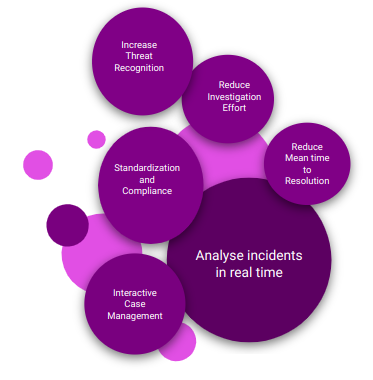

A case in DNIF is a structured unit used to manage and resolve security incidents. It serves as a container for signals and context related to a specific incident or group of related events. By organizing these details in one place, cases streamline the incident response process and facilitate collaboration among security teams.   

Case management is streamlined to speed up investigations, provide proactive incident response, and facilitate process compliance, making it easier to close more security alerts in less time. This enables your security team to focus on high-priority security events while the low-priority events are automatically dealt. It is a means to analyze data connected to specific events and incidents to ensure that threats do not slip through. This further helps in decreasing the response time and increasing the overall security and efficiency.

###### **Analyze incidents in real time**  
  

Analysts can access a single record view to dynamically analyze and interact with all the concurrent connections that were accessed by the particular compromised user. This facilitates easier compliance and quick response to security events as soon as they are detected or identified.

###### **Standardization and compliance**  
  

Workflow-driven case management ensures that Analysts are working with the right data at all times and are able to follow the correct incident response processes for any use case quickly and intuitively.

###### **Interactive case management**  
  

Users can easily research, assess and perform additional investigations from within each individual case without leaving the DNIF platform to search in third-party systems.

###### **Reduce Investigation Effort and Increase Threat Recognition**  
  

A summarized view into the incident details, makes it easier for a security professional to understand context and actions that should be taken. Security teams are better equipped to dynamically defend the organization’s technical infrastructure while at the same time, avoid getting overburdened and exhausted with an increasing number of security incidents in real-time.

###### **Reduce mean-time-to-resolution**  
  

Mean time to resolution denotes the average time required to troubleshoot and repair an issue. A low mean time to resolution indicates that an entity or service can be repaired quickly and, consequently, that any IT issues associated with it will probably have a reduced impact on the business.
