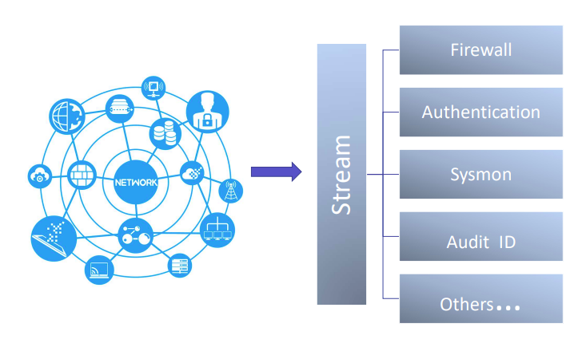

Source streams are the log sources on your network. The source streams are categorized on the basis of infrastructure, security, applications, servers etc. For Example: Logs of common hardware do have the same data format and are grouped into one. In our case, it would directly pinpoint the source stream from where the signal originated and the designated team can carry out the investigation.

For more details on Streams refer [Managing Streams](https://dnif.it/kb/operations/managing-streams/)

