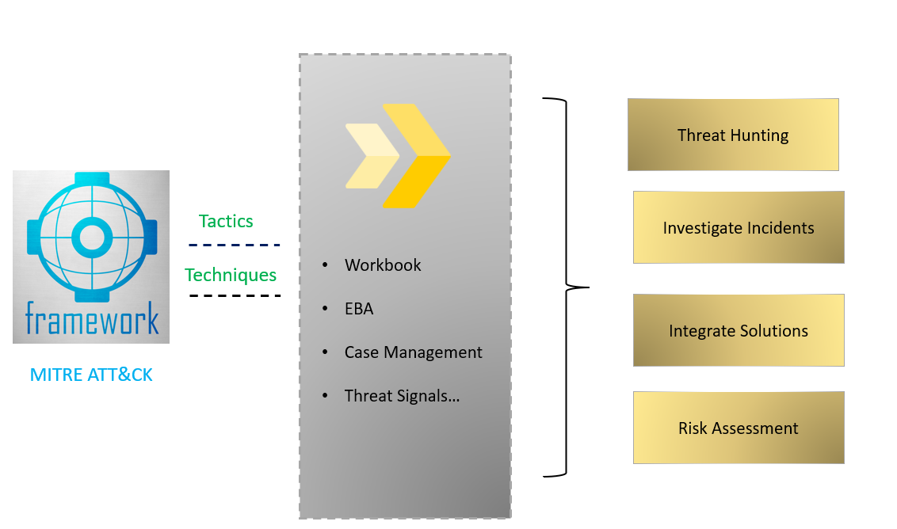

MITRE ATT&CK® is a globally-accessible knowledge base of adversary tactics and techniques based on real-world observations. The MITRE ATT&CK® knowledge base is used as a foundation for the development of specific threat models and methodologies in the private sector, in government, and in the cybersecurity product and service community.

###### **MITRE ATT&CK® Framework and DNIF**

The MITRE ATT&CK® Framework helps DNIF in their efforts to understand attacker behaviour and mitigate the risks and threats facing them using Workbooks, Connected Signals and other threat detection mechanisms. With DNIF the threat detection, investigation and response procedure is automated. You can directly map the observations in the environment to the techniques and tactics.

Security teams can associate the different alerts generated with specific tactics and techniques within the MITRE ATT&CK® framework. As time advances more and more tactics, techniques, malicious actors, tools, malware and mitigations are identified during operations and added to the MITRE ATT&CK® knowledge base. This helps in management and tracking of defensive measures and strengthening the overall security of the organization. By utilizing this data security teams can track alerts and gather insight with a clearer understanding of the different attack vectors used against your organization.

###### **Benefits**

- **Context:** For true security effectiveness, threat alerts must contain context to allow security teams to effectively prioritize threats and organize response.

- **Adversary awareness:** Adversary awareness helps you to identify the threats that are capable of causing harm to the enterprise data, its sensitivity, value, and other factors that contribute to the formulation of an appropriate response.
