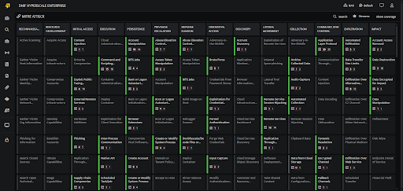
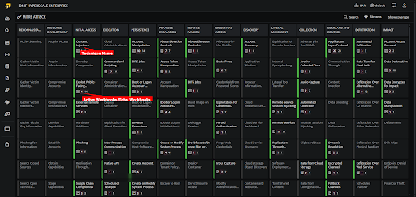
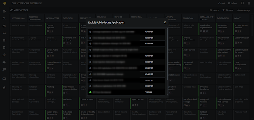

The **MITRE ATT&CK** page presents detection workbook coverage mapped to the MITRE ATT&CK framework. It offers a visual representation of how detection workbooks align with the framework, enabling users to easily analyze and monitor coverage across tactics, techniques, and sub-techniques. 

###### **Steps to Access the MITRE Page in the DNIF Console**

- Click on the MITRE ATT&CK icon on the left navigation bar of the Home screen to display the following screen. By default, the MITRE page opens to display the Coverage tab. You can switch to the Signals tab to view the signal activity across MITRE techniques.  
      
      
    

- **Tactic, Techniques and Sub-Techniques**
    - Each Technique block shows:
        - The Technique Name.
        
        - Active Workbooks and Total Number of Workbooks.  
              
              
              
              
    
    - **Workbooks**: View the total number of workbooks and the total number of active workbooks.  A workbook is considered active if its corresponding stream contains log data and is either scheduled or streamed and is denoted by a green bullet. To access the workbook, hover over it and open it in a new tab.  
          
          
          
