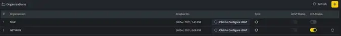
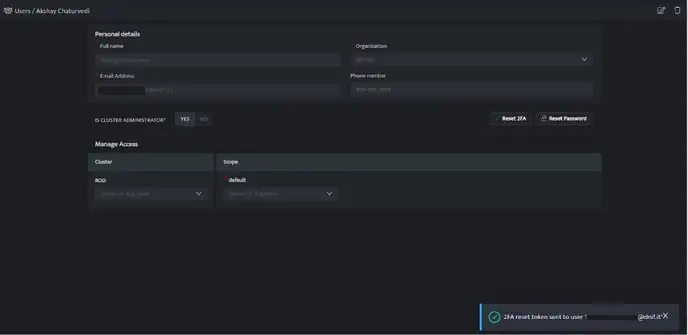

Two-Factor Authentication, adds an extra layer of protection to your system and intranet/extranet login. With MFA, your password alone is no longer enough to access your system, it has dramatically improved the security of your personal information you store in the system. You can enable the MFA feature, which mandates the personnel to enter an additional passcode (Time-based One-Time Password (TOTP) after entering the login password. So, even if an unauthorized person knows the system credentials, the MFA feature secures an account against unauthorized logins.

DNIF uses Time-based OTPs for Two-Factor Authentication (2FA), you will require an Authenticator Application.

###### **Prerequisites**

- Configure SMTP on DNIF Console

- Authenticator Application

###### **Recommended Applications**

- Google Authenticator

- Microsoft Authenticator

- Authenticator Chrome Extension

###### **How to enable Two-Factor Authentication (2FA)?**

- Navigate to **Administration Panel** > **Organizations**, the following screen will be displayed.

- In order to enable Two-Factor Authentication (2FA) for an organization, toggle on the 2FA status for that organization.

- As the Two-Factor Authentication (2FA) is enabled for an organization, all the users will receive an email bearing the secret required to configure the Authenticator App.

- Once the Two-Factor Authentication (2FA) is enabled all the users will have to provide an OTP in addition to the email address and password for Authentication.

###### **Reset Two-Factor Authentication (2FA)**

- In order to reset the Two-Factor Authentication (2FA) for a user, Navigate to **Administration Panel** **\>** **Manage Users**, the following screen will be displayed.

- Select the user for which you want to reset Two-Factor Authentication (2FA) and click **Reset 2FA**.

- An email will be sent to the user bearing the secret required to re-configure the Authenticator Application.
