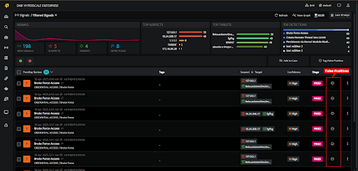

Introduced in v9.2.0

A false positive is a false alarm. This occurs when the system identifies an attack and triggers an alarm but it is acceptable behavior.

False positives are security alerts indicating there is a threat but actually these are non malicious and are not threats.

Refer this video to tag/untag a signal as False Positive:

You can also tag/untag an already raised signal as false positive, following are the steps:

- On this same signal listing page, select the particular signal that you want to tag/untag as false positive.

- Click on the circle with the minus sign icon displayed next to the confidence column on the right against the signal and select **Tag as False Positive/Untag as False Positive**.

<video width="100%" height="auto" controls>
  <source src="./images-FalsePositives/FalsePositives-2.mp4" />
  Your browser does not support the video tag.
</video> 

- Once tagged as false positive, signals will not be raised from this particular source.

- All signals tagged as false positive can be viewed under **Triaged Signals** on the signals list page.

- Signals that are untagged as False Positive can be viewed under the Pending **Review** signals list page.

- You can also tag/untag multiple signals at a time.
