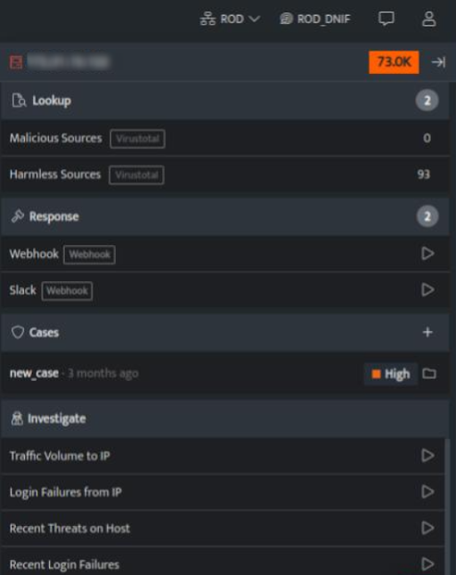

DNIF helps in accelerating threat detection and empowering your IT team to analyze log data. With Investigate Anywhere you can dig deep into security event logs and investigate incidents faster. During an investigation, additional information may emerge that justifies broadening the scope of the investigation beyond the initial allegations. You can click on a suspicious entity and start investigating the details and make decisions at that point in time. The security team can take all the necessary actions if new and different allegations are discovered during the course of the investigation. An effective plan can be laid out to eliminate all the blind spots between detection and remediation. The goal is to minimize damage, root out entrenched attackers and block similar future attacks.

###### **Investigate Anywhere Panel**  
  

Investigate Anywhere, this will allow you to investigate the entity with a single click anywhere across the application and the investigate panel will be displayed.  

| **Field** | **Description** |
| --- | --- |
| Entity | Displays the name of the entity |
| Risk Score | Displays the cumulative risk score assigned to this particular entity. |
| Lookup | Displays the details of the specific entity. It includes the enriched meta data of the entity. |
| Response | Displays the list of available responders (trigger plugins) for this particular entity. |
| Cases | Displays the list of cases for the selected entity |
| Investigate | Displays the list of parameterised workbooks related to this particular entity. You can also run the workbook directly from here to start the investigation and view results. |

- You can also add an entity to new / existing cases

- To view the investigation panel, you can right click on $user, $srcIP and $DstIP anywhere across DNIF
