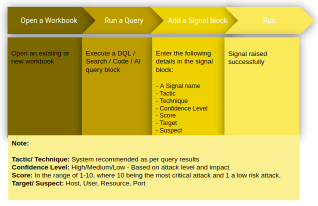
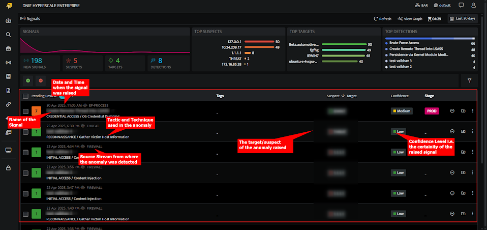
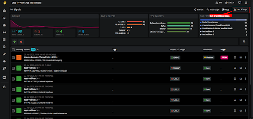

You can raise a signal from the workbook by adding a [Signal block](https://dnif.it/kb/hunting-with-workbooks/getting-started-hunting-with-workbooks/create-a-signal-block/).

On executing the following query you can view whether a signal has been raised or not.

\_fetch \* from event where $Stream=SIGNALS limit 10

The signals icon on the left navigation bar will allow you to view all the signals raised in the tenant (previously known as cluster).

######   
**Duration**  
  

You can always view signals based on the duration when it was raised.

  
  
You can select the following time ranges as per your requirement.

1. **Quick Select:** In this category you can enter any number and set to retrieve the data for that many minutes/hours or days.

3. **Presets**: Lists all the available preset options.

5. **Date Range**: Select a custom date and time range from the calendar.

7. The following are the list of available options under Quick Select and Preset.
    - **Last 5 minutes:** Displays signals raised during the last 5 minutes
    
    - **Last 30 minute:** Displays signals raised during the last thirty minutes
    
    - **Last one hour:** Displays signals raised during the last one hour.
    
    - **Last one day (default value):** Displays signals raised during the last one day.
    
    - **Last one week:** Displays signals raised during the last week
    
    - **Last one month:** Displays signals raised during the last one month
