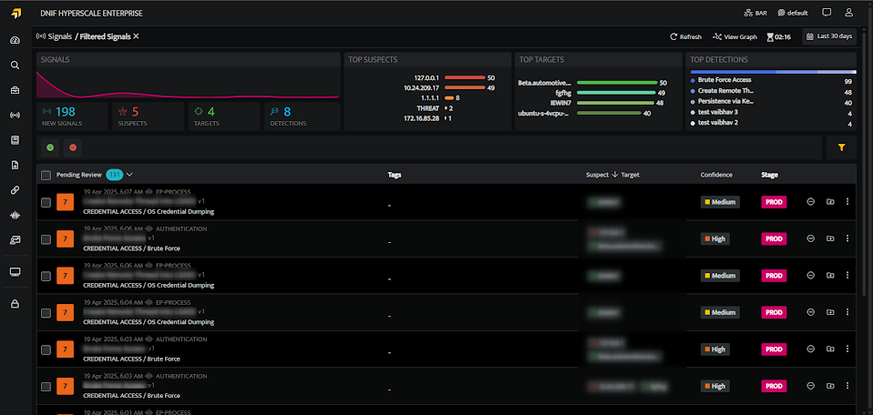
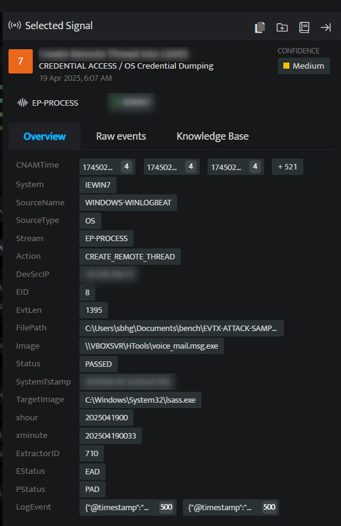

Signal Context details help you understand all the multiple entities that are related to the suspect or target entity. This allows you to fetch all the incidents in the raw log where the particular entity is repeated. All the raw logs connected to this entity or the raw logs including this entity will be displayed in the raw logs section and the overview section will give an overview of the entity in all the raw logs.

This page will help you understand the step by step procedure to view the context details of a particular signal.

######  **How to view Signal Context Details**  
  

- Click the **Signals** icon on the left navigation bar of the Home screen, the following screen will be displayed.  
      
      
      
    

- It displays the name of the signal, date and time when the signal was raised, tactic and the technique used in the anomaly.

- Click the name of the signal, to view the signal context details. The following screen is displayed.  
      
    

  
The Selected Signal screen displays the signal context details of the entity as follows.

| **Field Name**  | **Description** |
| --- | --- |
| Overview | This section gives a brief overview of all the raw log events fetched in the Raw Events section for a particular entity.Lets consider ten raw log events are fetched for a particular entity in the **Raw Events, then in the Overview section,** the numbers displayed next to the entities indicate that there are multiple entities involved and the number denotes the number of times each entity is repeated throughout the logs.   Also, If there is only one entity that is repeated throughout all the logs, then there won't be a number indicator next to the entity. |
| Raw Events | Displays all the the raw logs fetched for a particular entity |
|  | Use this icon to [Add Signal to Case](https://dnif.it/kb/security-monitoring/investigate-signals/how-to-add-a-signal-to-a-case/) |
|  | Use this icon to view the workbook where the signal was added |
