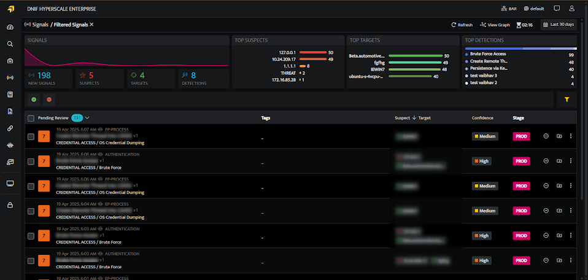

###### **Overview**  
  

A signal is a possibility to a potential threat, it's not an incident by itself depending on different confidence levels, you could easily identify it to be an actual incident or not. We would also have the ability to link together different signals and search through patterns against them to figure out if an actual incident happened. We have this real-time correlation happening because of which the signal is listed,

Signals that are raised from the workbook are automatically displayed here. On refreshing the page, it will be updated. You have real - time correlation which lets you know what is happening. Once you see this signal, you can click on the workbook to find out what caused it to execute this signal.

The Signals screen displays all the signals that were raised from the workbook. The signal listing displays severity by colour code and risk score.

On each refresh the page is updated with real-time correlation so that you have a clear understanding of the ongoing events.

###### **Key Aspects**  
  

- Automatically track and analyse the incidents that been identified  
    All the context around an incident is captured in detail and can be taken into account at multiple levels.

- Analysts can visualize the relationship between who, how and where of the whole attack process.

- Signals can be mapped to the MiTRE Att&CK paging where each signal needs to have a detection tactic, and a detection technique which corresponds to the Mitre framework.

- The concept of a connected graph which connects the signals for you and presents a larger picture.

- Connected graphs would help in reducing the number of alerts to be investigated, Analysts will have to investigate the graphs instead of investigating all the individual signals.
