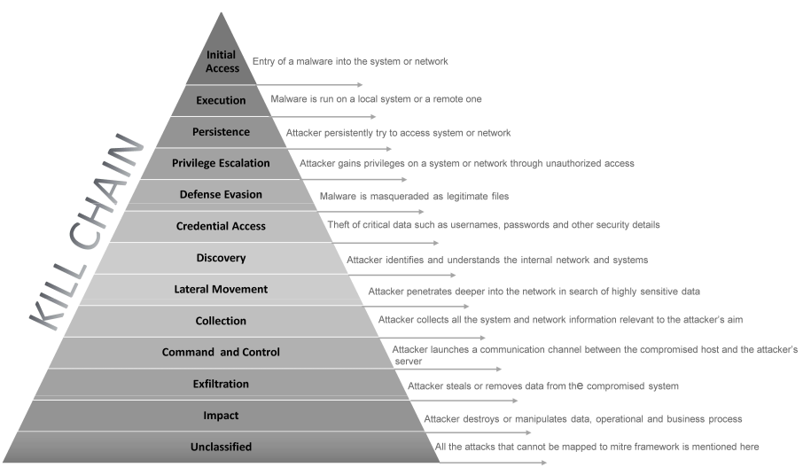
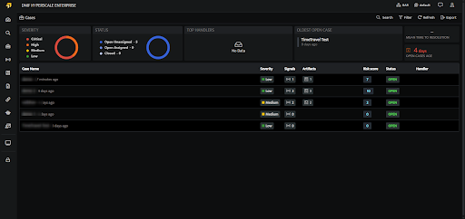
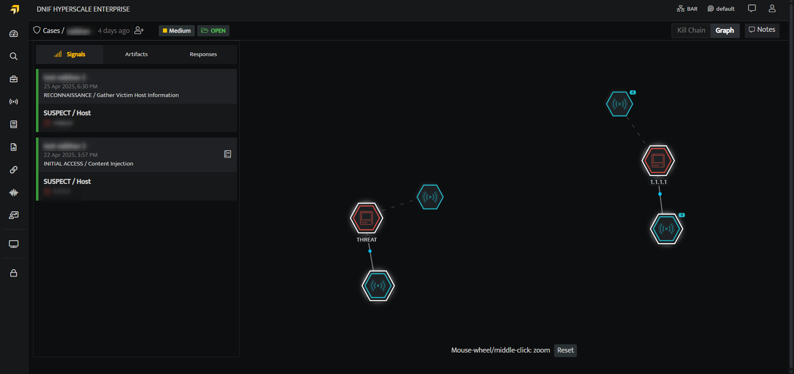
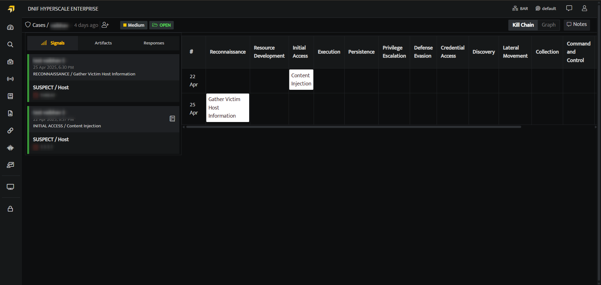

The kill chain model mainly maps to the Mitre attack techniques and tactics and helps us to understand the sequence of events involved in an attack on the network.

###### **Significance**  
  

The purpose of the model is to better understand the stages an attacker must have gone through to conduct an attack, and help security teams stop an attack at each stage. Understanding the kill chain model can help IT security teams to put strategies and technologies in place to “kill” or contain the attack at various stages, and secure the IT ecosystem.

###### **Kill Chain View**  
  

- On the left navigation bar, Click the **Cases** icon  to view the following page.

- On the cases list page, click on a particular case to view the details of all the signals assigned to that particular case.

- This screen displays all the summary of all the signals and artifacts that are associated with the selected case. On the top right corner click **Kill Chain**, to view the following screen.  
      
    

- This screen will help you trace the sequence of events involved in an attack, identifies vulnerabilities, and helps security teams to stop the attacks at every stage of the chain.
