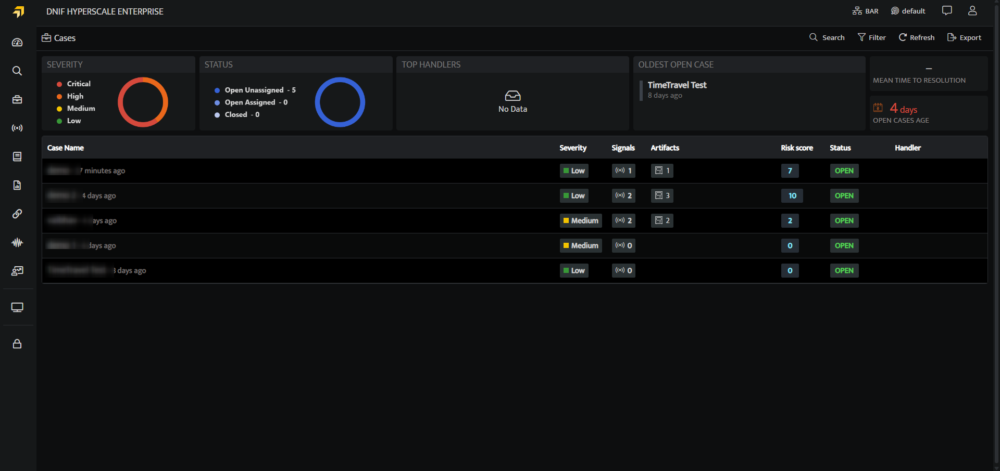
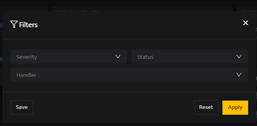

Searching and filtering cases allow users to quickly locate and focus on specific cases by applying relevant filters

###### **Search Cases by name**

- On the left navigation bar, Click the **Cases** icon  to view the following page.  
      
      
      
    

- Users can search for existing Cases by the Case name using the **Search**.  
      
      
      
    

###### **Filter Cases**  

- On the left navigation bar, Click the **Cases** icon  to view the following page.  
      
      
      
    

- Click the **Filters** icon to apply Filters.  
      
      
      
      
    

| **Fields** | **Description** |
| --- | --- |
| Severity | Users can filter the Case by Severity(low, medium, high, critical) |
| Status | Users can filter the Case by Status(Open, In-Progress, On-Hold and Close) |
| Handler | Users can filter the Case by the Handler name. |
| Apply | Click to apply the filter |
| Reset | Click to reset the filter |
| Save | Click to save the filter |

