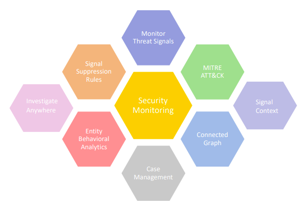

**Security monitoring** is the process that continuously monitors and flags all the vulnerabilities, new and existing security problems and measures. It effectively analyzes using the various features, so that the mean time to resolution is extremely low, indicating that an entity or service can be repaired quickly and, consequently, any IT issues associated with it will probably have a reduced impact on the business.

###### **Features of Security Monitoring**  
  

- **Case management:** Case management is grouping signals of similar context and background into a case so that investigations are streamlined, provides proactive incident response, and facilitate process compliance, making it easier to close more security alerts in less time. 

- **Connected Graph:** This is a rule based correlation, on-demand outlier detection and anomaly model along with automated analysis through graph analytics and threat intelligence. A detailed understanding of every signal raised and at the same place, visualize and diagnose all the connected anomalies and compromises that happened, a summary of all the observations are generated.

- **MITRE ATT&CK® :** A globally-accessible knowledge base of adversary tactics and techniques based on real-world observations. 

- **Monitor  Threat Signals:**  Signal is an individual event that would be indicating any suspicious or malicious event, but by itself it is not an incident. 

- **Signal Suppression Rules:** This allows you to suppress signals that are triggered by known sources and activities in your organization. 

- **Investigate Anywhere:** Allows you to dig deep into security event logs and investigate incidents faster. 

- **Signal Context :** This helps you understand all the multiple entities that are related to the suspect or target entity. 

- **Entity Behavior Analytics:** EBA identifies any suspicious behavior by tracking user behavior and raises an alert on every instance of a violation.
