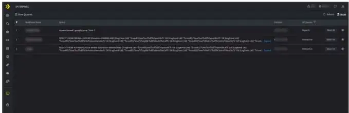
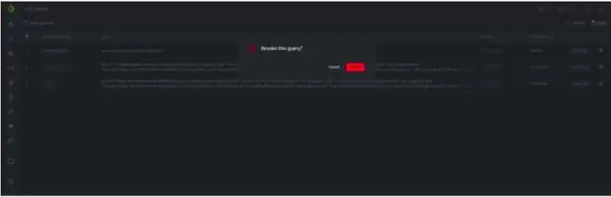

The Slow Queries page displays lists of all queries that have been running/processing for a long time but haven't completed yet. A query is considered to be a slow query when it is taking too long to process and return the result. Depending upon what the query is used for, it is sent to an appropriate Worker Queue.

There are 3 types of Worker queues viz. Interactive, Analytics, and Reports. Each queue has its own individual threshold of time for marking a running query as slow.

- **Interactive:** This queue consists of all the queries that are interactive, and each query has a threshold time limit of **five minutes**. If the results are not displayed after five minutes, the query will be displayed under slow queries.

- **Analytics:** This queue consists of all the queries run to derive some kind of analysis, and each query has a threshold time limit of **two minutes**. If the results are not displayed after two minutes, the query will be displayed under slow queries.

- **Reports:** This queue consists of all the queries run to derive reports, and each query has a threshold time limit of **60 minutes**. If the results are not displayed after 60 minutes, the query will be displayed under slow queries.

The page is automatically refreshed after 60 seconds.

###### **How to view Slow Queries?**

- Hover on the Administration icon on the left navigation panel and select Slow Queries, the following page will be displayed.

| **Field** | **Description** |
| --- | --- |
| Workbook Name | Lists the Workbook name from where the query was run, you can also navigate to the workbook from where the query is run. |
| Query | Displays the query details |
| Initiator | Displays the name of the user who initiated the query |
| Queue Type | Displays the queue type of the executed queryInteractiveAnalyticsReports |
| Duration | Displays the duration for how long the query is in the running or processing state. |
| Stop icon | Click this to revoke the query |

- Click the stop icon on the extreme right of each row to revoke that particular query, and a confirmation window will be displayed as follows.

- Click **Revoke** to cancel the query processing, or click cancel to continue in the processing/running state.
