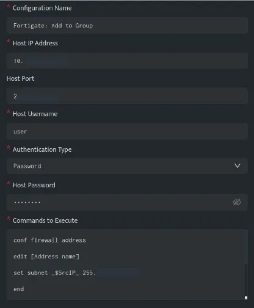
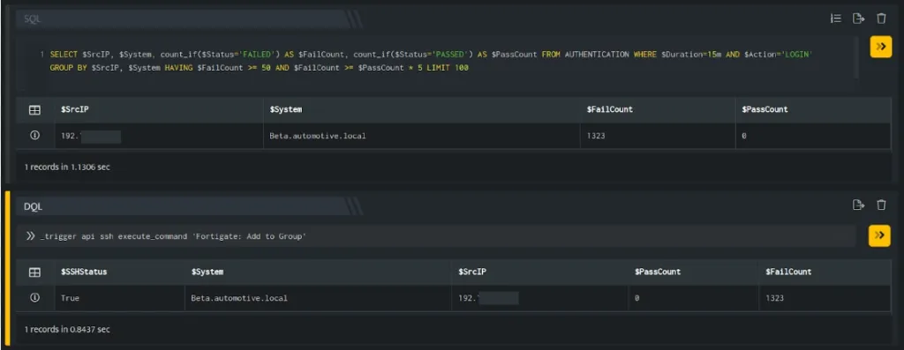
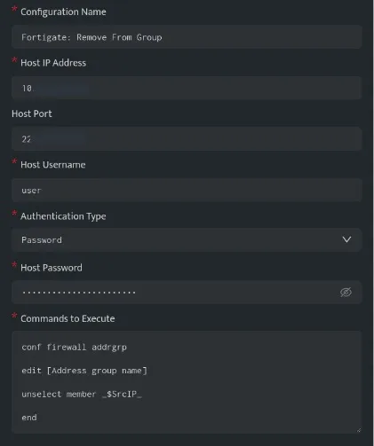
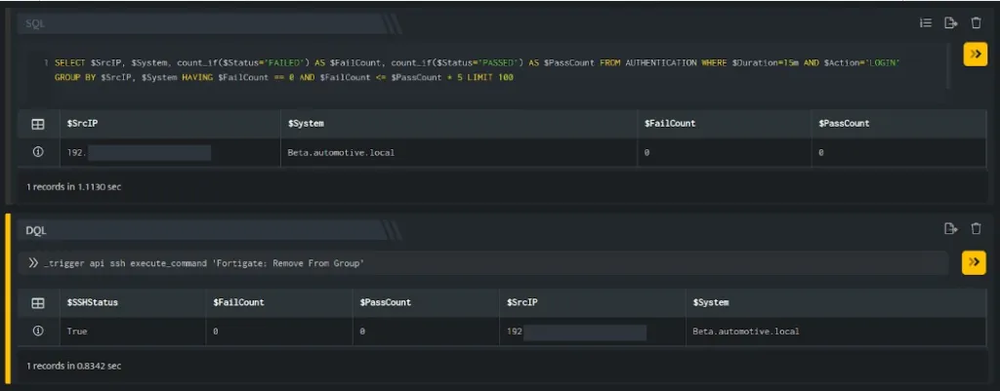

This article lists examples demonstrating practical use cases for taking action on Fortigate servers

- [Add Host to Group](#Add-Host-to-Group-Fortigate)

- [Remove Host from Group](#Remove-Host-from-Group-Fortigate)

###### **Add Host to Group (Fortigate)**

The below configuration allows you to connect to the FortiGate host and run any command



In the above configuration, execute the following commands

```
conf firewall addressedit [Address name]set subnet _$SrcIP_ 255.255.255.255endconf firewall addrgrpedit [Address group name]append member [Address name]end
```

The above set of commands will add an IP Address to a certain group. Ensure the commands are valid for your Fortigate version using the [documentation](https://docs.fortinet.com/document/fortigate/6.0.0/cli-reference/969597/firewall-address-address6).



In the above figure, a search query is executed that displays all the suspicious IP Addresses that have failed at their login attempts more than 50 times. Using \_trigger query, an API call is made to the above ssh integration configuration, which will add the IP Addresses in the $SrcIP column to the group mentioned in the configuration.

You need to apply the firewall rules to block the IP Addresses present in the group.

###### **Remove Host from Group (Fortigate)**

The below configuration allows you to connect to the FortiGate host and run any command



In the above configuration, execute the following commands

```
conf firewall addrgrpedit [Address group name]unselect member _$SrcIP_end
```

The above set of commands will remove an IP Address from a certain group. Ensure the commands are valid for your FortiGate version using the [documentation](https://docs.fortinet.com/document/fortigate/6.0.0/cli-reference/969597/firewall-address-address6).



In the above figure, a search query is executed that displays all the IP Addresses that do not have any failed login attempts. Using \_trigger query, an API call is made to the above ssh integration configuration, which will remove the IP Addresses in the $SrcIP column from the group mentioned in the configuration.
