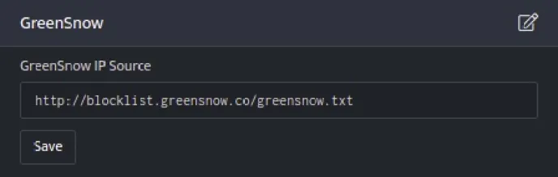
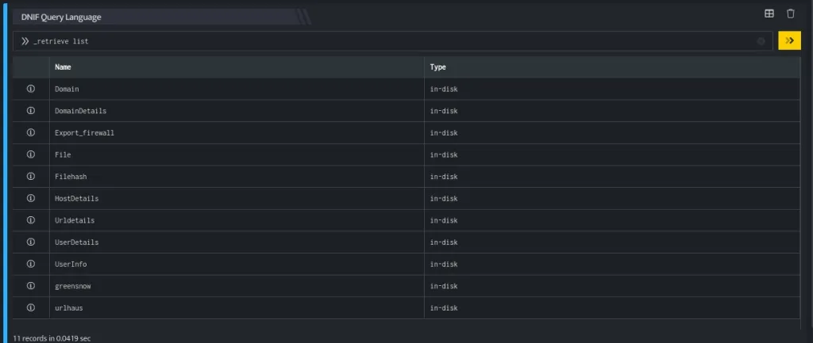
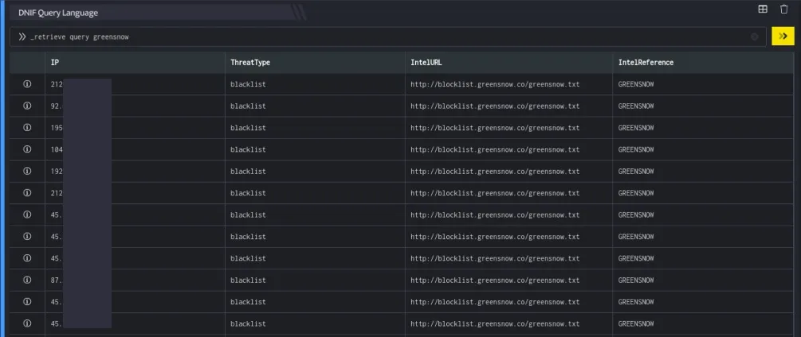

GreenSnow is a team consisting of the best specialists in computer security, who harvest a large number of IPs from different computers located around the world. GreenSnow is comparable with SpamHaus.org for attacks of any kind except for spam.

###### **GreenSnow IP feeds**

Attacks / bruteforce that are monitored are as follows:

- Scan Port

- FTP

- POP3

- mod\_security

- IMAP

- SMTP

- SSH

- cPanel  
    

###### **Configuration**

GreenSnow is a pre-configured integration in DNIF that stores its data as a dataset in an eventstore, this is a scheduled eventstore and can be used to fetch threat intel data for IP Addresses.

- Follow the initial configuration steps in [How to Configure Automation?](https://dnif.it/kb/uncategorized/configuring-automation/)  
      
      
      
    

- Click the edit icon to add details.  
    

| **Field** | **Description** |
| --- | --- |
| GreenSnow IP Source | Enter valid IP Source |

- Enter the above details and click **Save**.  
    

###### **Dataset integrated with GreenSnow**

**Retrieve threat intel data**

Retrieve threat intel data for IP Addresses. GreenSnow is a pre-configured integration in DNIF that stores its data as a dataset in an eventstore, this is a scheduled eventstore and can be used to fetch threat intel data for IP Addresses.

**Function\_name**

```
import_ip_intel
```

**Input**

```
_retrieve list
```

The above query, retrieves a list of all the existing event stores. The output is as shown below:



**Output**

```
_retrieve query greensnow
```

In the pipelined query function, the \_retrieve directive calls the import\_ip\_intel function of the GreenSnow plugin, to fetch threat intel data for IP Addresses.

The output is as shown below:



**Output Structure**

| **Field** | **Description** |
| --- | --- |
| EvtType | An IP/Domain |
| ThreatType | DNIF Feed Identification Name |
| IntelURL | Feed URL |
| IntelReference | Feed Name |
