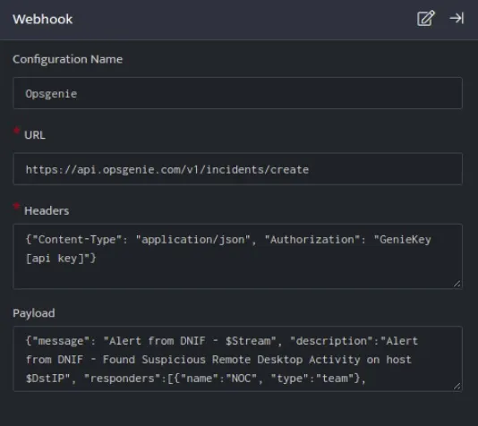
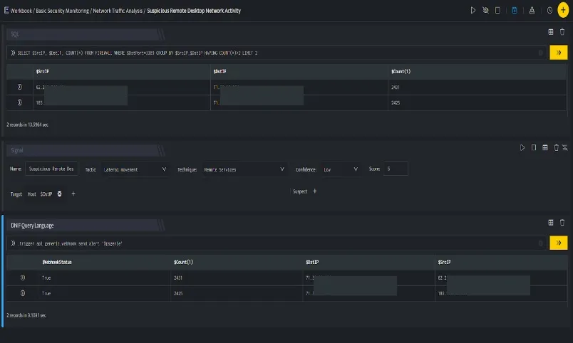

DNIF can send webhook alerts to Opsgenie that acts as a dispatcher and determines the right people to notify.

###### **Configuration**

1. In the **[Configuration](https://dnif.it/kb/uncategorized/configuring-automation/) Box**, enter the **Configuration Name** to uniquely identify this configuration.

3. Identify the [**content of headers and payload**](https://docs.opsgenie.com/docs/incident-api) that you need to provide in the Configuration Box.

Below is an example on how you can leverage this integration to create an incident on Opsgenie

**Payload**

```
{   "message":"Alert from DNIF - $Stream",   "description":"Alert from DNIF - Found Suspicious Remote Desktop Activity on host $DstIP",   "responders":[      {         "name":"NOC",         "type":"team"      },      {         "id":"bb4d9938-c3c2-455d-aaab-727aa701c0d8",         "type":"user"      }   ],   "tags":[      "Critical"   ],   "priority":"P1"}
```



Opsgenie, creates an event on the Opsgenie account based on the values given in the payload.



In the above figure, a workbook named **Suspicious Remote Desktop Network Activity** is executed which contains the following blocks:

- **SQL Block:** Displays two suspicious Destination IPs on execution of the workbook

- **Signal Block:** This will raise a signal on detecting the suspicious IPs.

- **DQL block with \_trigger query:** Using **Webhook integration for Opsgenie**, an incident is created on the Opsgenie account based on the values given in the payload.
