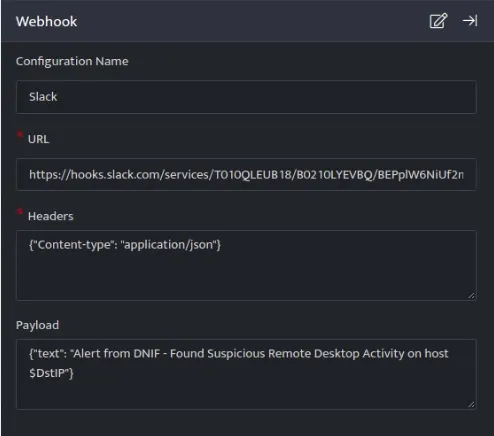
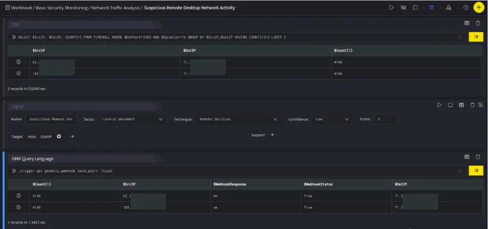
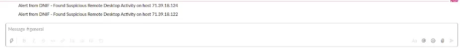

Slack is a messaging application for business. It transforms the way that organisations communicate by bringing people together to work as one unified team.

###### **Configuration**

- In the **[Configuration](https://dnif.it/kb/uncategorized/configuring-automation/) Box**, enter the **Configuration Name** to uniquely identify this configuration.

- [Create a webhook](https://dnif.it/kb/automation/supported-automation/webhook/) for a slack channel in your account.

- [Identify the content of headers and payload](https://api.slack.com/messaging/webhooks#posting_with_webhooks) that you need to provide in the Configuration Box.

Below is an example on how you can leverage this integration to send alerts to your Slack Channel.

**Payload**

```
{   "text":"Alert from DNIF - Found Suspicious Remote Desktop Activity on host $DstIP"}
```



Slack API, delivers text mentioned in the **Payload** to your slack channel. This plugin is basically provisioned to replace the $SrcIP, $DstIP variables with the value received from the data stack received on running a Search block.



In the above figure, a workbook named **Suspicious Remote Desktop Network Activity** is executed which contains the following blocks:

- **SQL Block:** Displays two suspicious Destination IPs on execution of the workbook

- **Signal Block:** This will raise a signal on detecting the suspicious IPs.

- **DQL block with \_trigger query:** Using **Generic Webhook plugin for Slack**, an alert will be raised to the slack channel with the message mentioned in payload as displayed below:  
    


