Trend Micro is a cloud-client content security infrastructure that delivers global threat intelligence to protect from online threats, such as data stealing malware, phishing attacks, and other web, email, and mobile threats. It helps to deliver continuously updated protection to stop phishing, ransomware, Business Email Compromise (BEC) scams, spam and other advanced email threats before they reach your network. It provides advanced protection for Microsoft™ Exchange Server, Microsoft Office 365, Google™ Gmail, and other cloud or on-premises email solutions.

###### **Examples**

Listed below are some of the examples to configure a Webhook connection for the following use cases:

- TrendMicro XDR: Block IP

- TrendMicro XDR: Block URL

- TrendMicro XDR: Block Domain

- TrendMicro XDR: Block Email

- TrendMicro XDR: Block FileHash

###### **TrendMicro XDR: Block IP**

- In the **Configuration Box**, enter the **Configuration Name** to uniquely identify this configuration.

- Identify the [content of headers and payload](https://automation.trendmicro.com/xdr/api-v2#tag/Common/paths/~1v2.0~1xdr~1response~1block/post) that you need to provide in the Configuration Box.

- Ensure you enable the integration, once it is [configured and validated](https://dnif.it/kb/uncategorized/configuring-automation/).

Below is an example on how you can leverage this integration to block an IP using TrendMicro

**URL**

```
https://api.xdr.trendmicro.com/v2.0/xdr/response/block
```

**Header**

```
{"Authorization": "Bearer [token]" , "Content-Type": "application/json;charset=utf-8"}
```

**Payload**

```
{  "valueType":"ip",   "targetValue":"$SrcIP",   "productId":"DNIF",   "description":"Blocking malicious IP"}
```

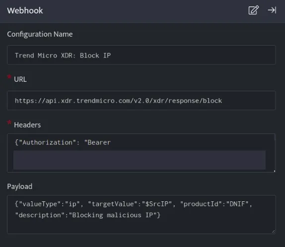

TrendMicro: Block IP, blocks the resource i.e IP on your TrendMicro account based on the values given in the payload.

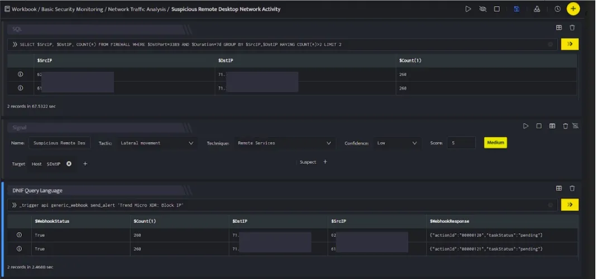

In the above figure, a workbook named **Suspicious Remote Desktop Network Activity** is executed which contains the following blocks:

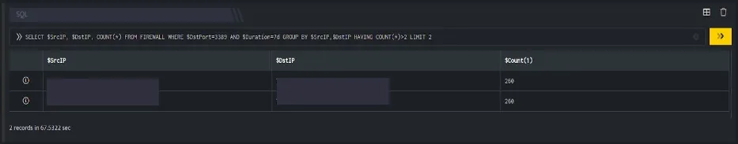

- **SQL Block:** Displays two suspicious Destination IPs on execution of the workbook

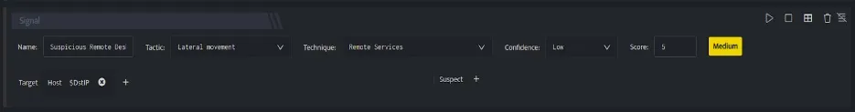

- **Signal Block:** This will raise a signal on detecting the suspicious IPs.

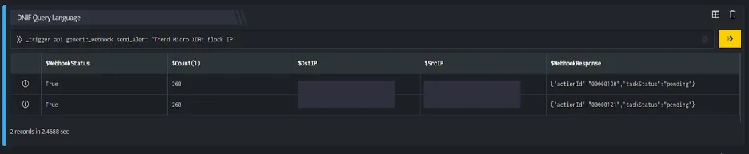

- **DQL block with \_trigger query:** Using **Webhook integration for TrendMicro: Block IP**, the IP is blocked on your TrendMicro account based on the values given in the payload.

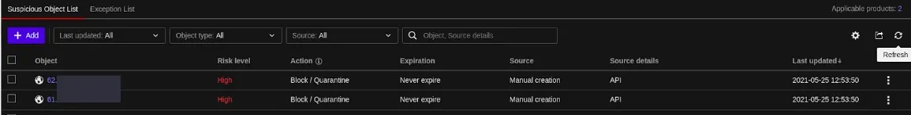

###### **TrendMicro XDR: Block URL**

- In the **Configuration Box**, enter the **Configuration Name** to uniquely identify this configuration.

- Identify the [content of headers and payload](https://automation.trendmicro.com/xdr/api-v2#tag/Common/paths/~1v2.0~1xdr~1response~1block/post) that you need to provide in the Configuration Box.

- Ensure you enable the integration, once it is [configured and validated](https://dnif.it/kb/uncategorized/configuring-automation/).

Below is an example on how you can leverage this integration to block an URL using TrendMicro.

**URL**

```
https://api.xdr.trendmicro.com/v2.0/xdr/response/block
```

**Header**

```
{"Authorization": "Bearer [token]" , "Content-Type": "application/json;charset=utf-8"}
```

**Payload**

```
{   "valueType":"url",   "targetValue":"$URL",   "productId":"DNIF",   "description":"Blocking malicious URL"}
```

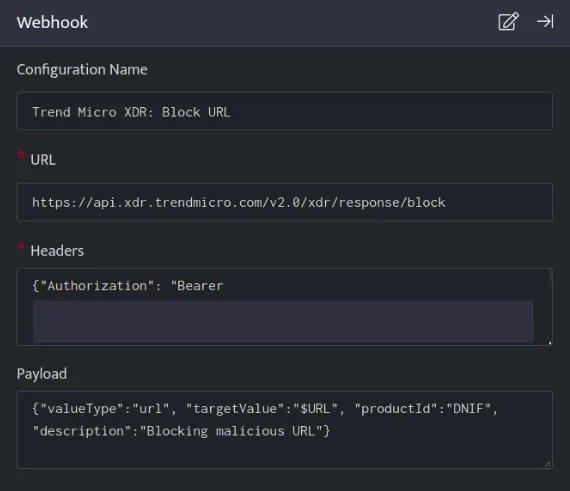

TrendMicro: Block URL, blocks the resource i.e URL on your TrendMicro account based on the values given in the payload.

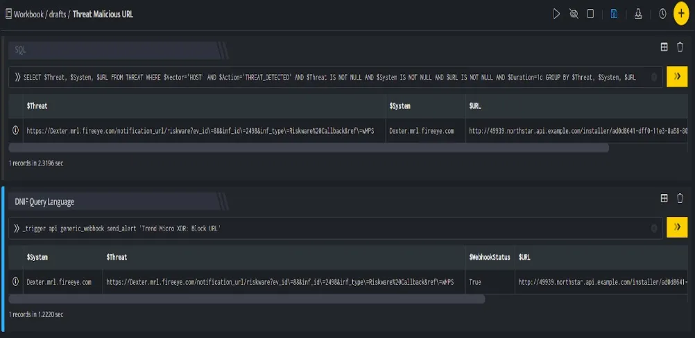

In the above figure, a workbook named **Threat Malicious URL** is executed which contains the following blocks:

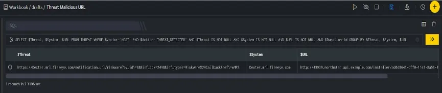

- **SQL Block:** Displays a malicious URL which is considered as threat.

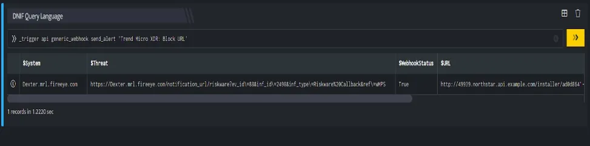

- **DQL block with \_trigger query:** Using **Webhook integration for TrendMicro: Block URL**, the URL is blocked on your TrendMicro account based on the values given in the payload.

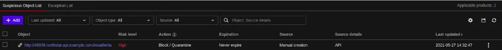

###### **TrendMicro XDR: Block Domain**

- In the **Configuration Box**, enter the **Configuration Name** to uniquely identify this configuration.

- Identify the [content of headers and payloads](https://automation.trendmicro.com/xdr/api-v2#tag/Common/paths/~1v2.0~1xdr~1response~1block/post) that you need to provide in the Configuration Box.

- Ensure you enable the integration, once it is [configured and validated](https://dnif.it/kb/uncategorized/configuring-automation/).

Below is an example on how you can leverage this integration to block an domain using TrendMicro

**URL**

```
https://api.xdr.trendmicro.com/v2.0/xdr/response/block
```

**Header**

```
{"Authorization": "Bearer [token]" , "Content-Type": "application/json;charset=utf-8"}
```

**  
Payload**

```
{   "valueType":"domain",   "targetValue":"$Domain",   "productId":"DNIF",   "description":"Blocking malicious Domain"}
```

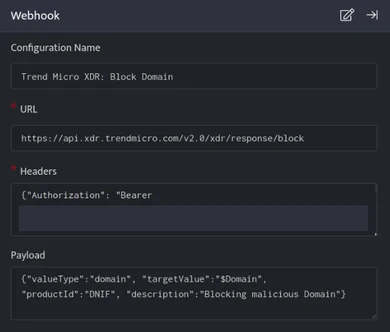

TrendMicro: Block Domain, blocks the resource i.e Domain on your TrendMicro account based on the values given in the payload.

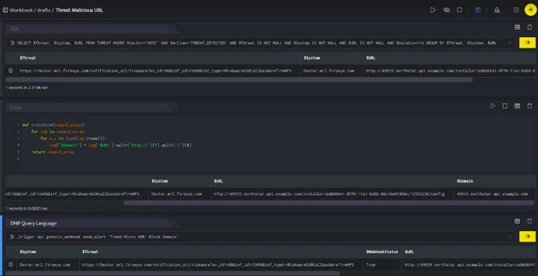

In the above figure, a workbook named **Threat Malicious URL** is executed which contains the following blocks:


- **SQL Block:** Displays one malicious URL which is considered as threat.


- **Code Block:** This will extract the domain from that URL and save it in column $Domain.

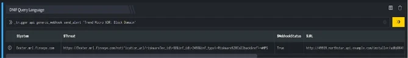

- **DQL block with \_trigger query:** Using **Webhook integration for TrendMicro: Block Domain**, the domain is blocked on your TrendMicro account based on the values given in the payload.

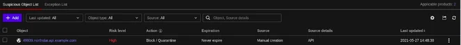

###### **TrendMicro XDR: Block Email**

- In the **Configuration Box**, enter the **Configuration Name** to uniquely identify this configuration.

- Identify the [content of headers and payload](https://automation.trendmicro.com/xdr/api-v2#tag/Common/paths/~1v2.0~1xdr~1response~1block/post) that you need to provide in the Configuration Box.

- Ensure you enable the integration, once it is [configured and validated](https://dnif.it/kb/uncategorized/configuring-automation/).

Below is an example on how you can leverage this integration to block an Email using TrendMicro

**URL**

```
https://api.xdr.trendmicro.com/v2.0/xdr/response/block
```

**Header**

```
{"Authorization": "Bearer [token]" , "Content-Type": "application/json;charset=utf-8"}
```

**Payload**

```
{   "valueType":"mailbox",   "targetValue":"$Sender",   "productId":"DNIF",   "description":"Blocking malicious Email"}
```

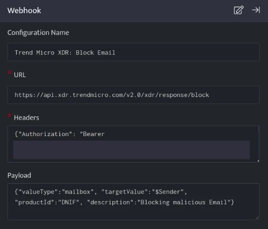

TrendMicro: Block Email, blocks the resource i.e Email on your TrendMicro account based on the values given in the payload.

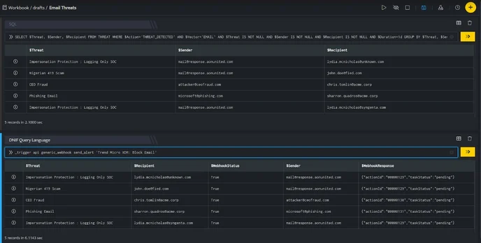

In the above figure, a workbook named **Email Threats** is executed which contains the following blocks:

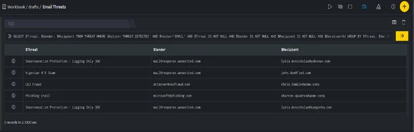

- **SQL Block:** Displays five emails that are considered as threats.

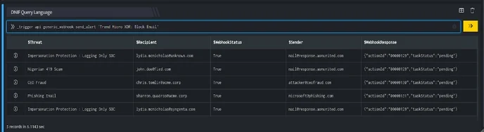

- **DQL block with \_trigger query:** Using **Webhook integration for TrendMicro: Block Email**, all the emails are blocked on your TrendMicro account based on the values given in the payload.

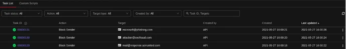

###### **TrendMicro XDR: Block FileHash**

- In the **Configuration Box**, enter the **Configuration Name** to uniquely identify this configuration.

- Identify the content of [headers and payload](https://automation.trendmicro.com/xdr/api-v2#tag/Common/paths/~1v2.0~1xdr~1response~1block/post) that you need to provide in the Configuration Box.

- Ensure you enable the integration, once it is [configured and validated](https://dnif.it/kb/uncategorized/configuring-automation/).

Below is an example on how you can leverage this integration to block an File Hash SHA1 using TrendMicro.

**URL**

```
https://api.xdr.trendmicro.com/v2.0/xdr/response/block
```

**Header**

```
{"Authorization": "Bearer [token]" , "Content-Type": "application/json;charset=utf-8"}
```

**Payload**

```
{   "valueType":"file_sha1",   "targetValue":"$ConfigurationFileHash",   "productId":"DNIF",   "description":"Blocking malicious File Hash"}
```

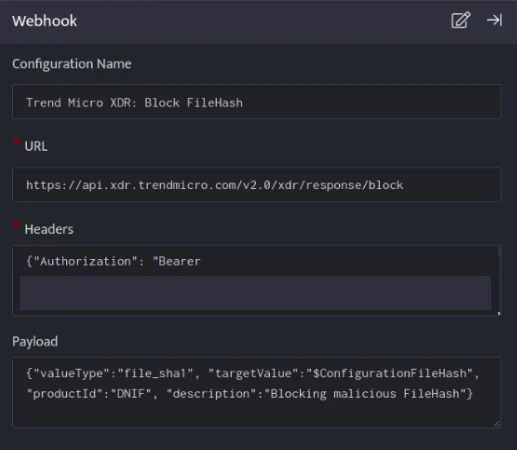

TrendMicro: Block FileHash, blocks the resource i.e FileHash on your TrendMicro account based on the values given in the payload.

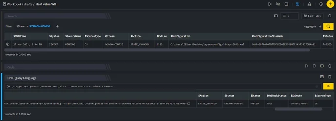

In the above figure, a workbook named **Hash value WB** is executed which contains the following blocks:


- **Search Block:** Displays a File Hash value which is considered a threat.


- **DQL block with \_trigger query:** Using **Webhook integration for TrendMicro: Block FileHash**, the File Hash is blocked on your TrendMicro account based on the values given in the payload.


