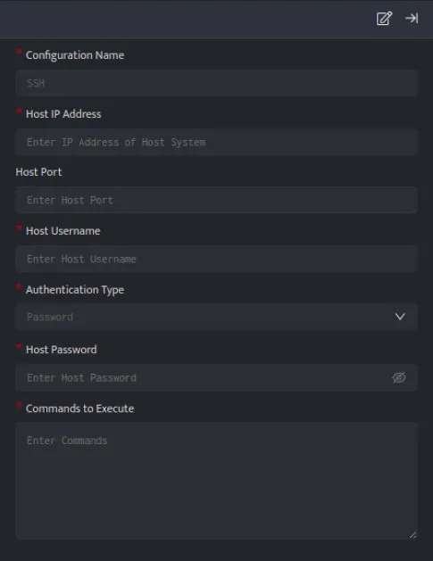

SSH, or Secure Shell, integration is used to establish a secure connection to a remote host and execute commands. It allows you to gain access and remotely manage other computers and transfer files.

###### **Configuration**

- Follow the initial configuration steps in [How to Configure Automation?](https://dnif.it/kb/uncategorized/configuring-automation/)  
      
    

- Click the edit icon to add details.

- You can authenticate ssh connection using host password/ private key  
    

To associate SSH automation config with investigate panel - it must provide exactly one substitution parameter - either $User or $Host.

| **Field** | **Description** |
| --- | --- |
| Configuration Name | Name for the plugin configuration |
| Host IP Address | IP Address of the host |
| Host Port (Optional) | Port of the host |
| Host Username | Username of the host |
| Authentication Type | Select the type of authentication (i.e. Password or Private Key) |
| Host Password | Enter the Password of the host to authenticate ssh connection (if Authentication Type is Password) |
| Private Key | Enter the Private key of the host to authenticate ssh connection (if Authentication Type is Private Key) |
| Commands to Execute | Enter the commands to execute on the remote host (each command should be executed on a new line) e.g. ping -c 1 127.0.0.1,ls /var/tmp |

- Enter the above details and click **Save**

**Query Syntax**

```
_trigger api ssh execute_command ‘<CONFIG_NAME>’
```

**Examples**  

Listed below are few examples, these examples will help you to quickly get started with the configuration process by demonstrating practical use cases.

- [How to secure a compromised user account?](https://dnif.it/kb/automation/supported-automation-ssh/secure-compromised-user-account/)

- Taking action on Firewall Servers
    - [Fortigate (Add/Remove Host)](https://dnif.it/kb/automation/supported-automation/fortigate-1/)
    
    - [PaloAlto (Add/Remove Host)](https://dnif.it/kb/automation/supported-automation/palo-alto/)
